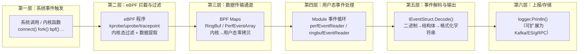
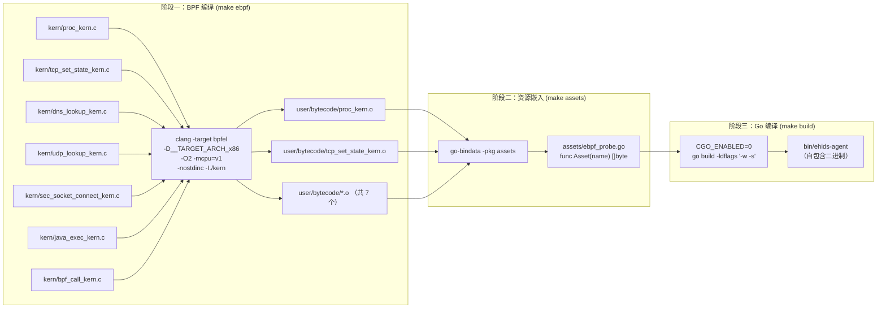
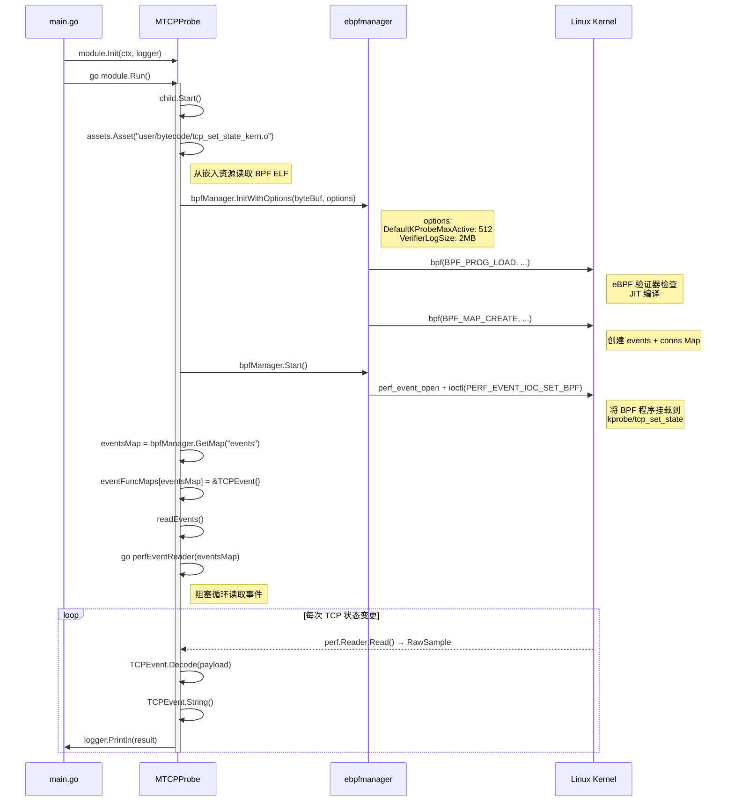
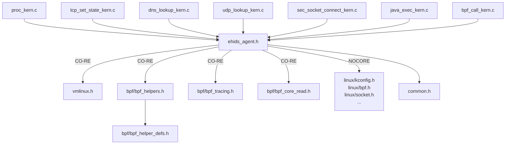

# ehids-agent 阶段一：全局架构拆解

> 分析日期：2026-03-27
> Skill：`ebpf-phase1-architecture`
> 项目：ehids-agent（https://github.com/ehids/ehids-agent）
> 贡献方：美团安全工程团队

---

## 目录

- [1. 项目总体架构](#1-项目总体架构)
  - [1.1 核心目标与设计理念](#11-核心目标与设计理念)
  - [1.2 整体架构图](#12-整体架构图)
  - [1.3 内核空间与用户空间分层关系](#13-内核空间与用户空间分层关系)
  - [1.4 主要模块划分及职责](#14-主要模块划分及职责)
- [2. 目录结构分析](#2-目录结构分析)
  - [2.1 完整目录树与职责说明](#21-完整目录树与职责说明)
  - [2.2 eBPF 内核态程序清单](#22-ebpf-内核态程序清单)
  - [2.3 用户空间程序入口与主要处理逻辑](#23-用户空间程序入口与主要处理逻辑)
- [3. 构建与加载流程](#3-构建与加载流程)
  - [3.1 编译工具链](#31-编译工具链)
  - [3.2 完整构建流水线](#32-完整构建流水线)
  - [3.3 CO-RE 与 NOCORE 双模式](#33-co-re-与-nocore-双模式)
  - [3.4 eBPF 程序加载与附加流程](#34-ebpf-程序加载与附加流程)
- [4. 依赖关系](#4-依赖关系)
  - [4.1 外部依赖库清单](#41-外部依赖库清单)
  - [4.2 内核特性依赖矩阵](#42-内核特性依赖矩阵)
  - [4.3 vmlinux.h 与头文件体系](#43-vmlinuxh-与头文件体系)
- [5. 逐文件分析清单](#5-逐文件分析清单)
- [6. 分析结论](#6-分析结论)

---

## 1. 项目总体架构

### 1.1 核心目标与设计理念

**核心目标**：利用 eBPF 内核技术，以**零侵入、高性能**的方式实现主机入侵检测系统（HIDS）的事件采集层，覆盖进程、网络、DNS、BPF 系统调用等多个安全检测维度。

**设计理念**：

| 设计原则 | 具体体现 |
|---------|---------|
| **模块化可插拔** | 每个探针独立为一个 Module，通过 `init()` 自动注册，互不干扰 |
| **内核态过滤** | 在 eBPF 程序中完成事件过滤（如 TCP 过滤本地连接、UDP 过滤端口 53），减少用户态开销 |
| **统一抽象** | `IModule` + `IEventStruct` 接口抽象，新增探针只需实现接口，无需修改框架 |
| **单文件部署** | 通过 `go-bindata` 将 BPF 字节码嵌入 Go 二进制，零外部依赖 |
| **双编译模式** | CO-RE（跨版本兼容）+ NOCORE（旧内核兼容），覆盖尽可能多的 Linux 环境 |

### 1.2 整体架构图

```mermaid
graph TB
    subgraph UserSpace["用户空间 (Go)"]
        MAIN["main.go<br/>入口 & 信号处理"]
        REG["register.go<br/>模块注册表"]
        MOD["imodule.go<br/>Module 基类<br/>模板方法 + 事件循环"]
        EVT["ievent.go<br/>IEventStruct 接口"]

        subgraph Probes["探针实现层（7 个独立模块）"]
            P1["probe_proc.go<br/>EBPFProbeProc"]
            P2["probe_ktcp.go<br/>EBPFProbeKTCP"]
            P3["probe_udns.go<br/>EBPFProbeUDNS"]
            P4["probe_kudp.go<br/>EBPFProbeKUDP<br/>⚠️ 未注册"]
            P5["probe_ktcp_sec.go<br/>EBPFProbeKTCPSec"]
            P6["probe_ujava_rasp.go<br/>EBPFProbeUJavaRASP"]
            P7["probe_bpf_call.go<br/>EBPFProbeBPFCall"]
        end

        subgraph Events["事件解码层"]
            E1["event_proc.go"]
            E2["event_tcp.go"]
            E3["event_udns.go"]
            E4["event_kudp.go"]
            E5["event_ktcp_sec.go"]
            E6["event_java_rasp.go"]
            E7["event_bpf_call.go"]
        end

        ASSETS["assets/ebpf_probe.go<br/>BPF 字节码嵌入"]
        EBPFMGR["ebpfmanager v0.2.2<br/>BPF 程序管理"]
        CILIUM["cilium/ebpf v0.8.1<br/>底层 BPF 加载"]
    end

    subgraph KernelSpace["内核空间 (C/eBPF)"]
        subgraph KProbes["kprobe / kretprobe"]
            K1["proc_kern.c<br/>kretprobe/copy_process"]
            K2["tcp_set_state_kern.c<br/>kprobe/tcp_set_state"]
            K3["udp_lookup_kern.c<br/>kprobe+kretprobe/udp_recvmsg"]
            K4["sec_socket_connect_kern.c<br/>kprobe/security_socket_connect"]
        end

        subgraph UProbes["uprobe / uretprobe"]
            U1["dns_lookup_kern.c<br/>uprobe+uretprobe/getaddrinfo"]
            U2["java_exec_kern.c<br/>uprobe/JDK_execvpe"]
        end

        subgraph TP["tracepoint"]
            T1["bpf_call_kern.c<br/>tracepoint/syscalls/sys_enter_bpf"]
        end

        subgraph Maps["BPF Maps"]
            M1["RingBuf: ringbuf_proc"]
            M2["PerfEventArray: events × 4"]
            M3["HashMap: conns / start / currres / tbl_udp_msg_hdr"]
            M4["LRU_HashMap: bpf_context"]
            M5["PerCPU_Array: dns_data / bpf_context_gen / bufs"]
        end
    end

    MAIN --> REG
    REG --> Probes
    Probes --> MOD
    MOD --> EBPFMGR
    EBPFMGR --> CILIUM
    CILIUM --> KernelSpace
    ASSETS --> EBPFMGR
    Events --> EVT

    K1 --> M1
    K2 --> M2
    K2 --> M3
    K3 --> M2
    K3 --> M3
    K3 --> M5
    K4 --> M2
    U1 --> M2
    U1 --> M3
    U2 --> M2
    T1 --> M2
    T1 --> M4
    T1 --> M5

    M1 -->|"ringbuf.Reader"| MOD
    M2 -->|"perf.Reader"| MOD
```



### 1.3 内核空间与用户空间分层关系



**分层要点**：

- **第二层是核心**：所有安全检测的数据采集逻辑在内核态完成，确保低开销
- **第三层是桥梁**：RingBuf（进程探针）和 PerfEventArray（其余 6 个探针）作为内核→用户态通信管道
- **第五层是解耦点**：每个探针独立实现 `IEventStruct`，解码逻辑与框架完全解耦

### 1.4 主要模块划分及职责

| 模块 | 注册名 | 类型 | 职责 | 状态 |
|------|-------|------|------|------|
| **进程监控** | `EBPFProbeProc` | kretprobe | 捕获进程 fork 事件，采集 3 级进程树、命令行、UID/GID、UTS namespace | ✅ 已注册 |
| **TCP 连接追踪** | `EBPFProbeKTCP` | kprobe | 追踪 TCP 连接全生命周期（SYN_SENT→ESTABLISHED→CLOSE），统计流量 | ✅ 已注册 |
| **DNS 解析追踪** | `EBPFProbeUDNS` | uprobe | 通过 libc getaddrinfo() uprobe 捕获 DNS 查询域名和解析结果 | ✅ 已注册 |
| **UDP DNS 捕获** | `EBPFProbeKUDP` | kprobe | 通过 kprobe udp_recvmsg 捕获端口 53 的原始 DNS 报文 | ⚠️ **未注册**（Register 被注释） |
| **Socket 连接监控** | `EBPFProbeKTCPSec` | kprobe | 通过 security_socket_connect 捕获所有 connect() 调用（IPv4/IPv6/其他） | ✅ 已注册 |
| **Java RASP** | `EBPFProbeUJavaRASP` | uprobe | 通过 libjava.so JDK_execvpe uprobe 捕获 Java 进程命令执行 | ✅ 已注册 |
| **BPF 系统调用** | `EBPFProbeBPFCall` | tracepoint | 通过 sys_enter_bpf tracepoint 捕获所有 BPF 系统调用及完整调用者信息 | ✅ 已注册 |

---

## 2. 目录结构分析

### 2.1 完整目录树与职责说明

```
ehids-agent/
│
├── main.go                              # [入口] 程序入口，rlimit 设置 + 模块编排 + 信号处理
├── go.mod                               # [构建] Go 模块定义（module ehids, go 1.17）
├── go.sum                               # [构建] 依赖锁文件
├── Makefile                             # [构建] 主构建脚本（336 行，支持 CO-RE 和 NOCORE 双模式）
│
├── kern/                                # ═══ [内核态] eBPF C 代码 ═══
│   ├── ehids_agent.h                    # [头文件] 主入口：CO-RE/NOCORE 条件编译分支（24 行）
│   ├── common.h                         # [头文件] 公共宏：debug_bpf_printk、license、version、常量（52 行）
│   ├── vmlinux.h                        # [头文件] 内核结构体定义（bpftool btf dump 生成，CO-RE 必需）
│   │
│   ├── bpf/                             # [头文件] libbpf 标准 BPF 辅助库
│   │   ├── bpf_helpers.h               #   SEC() 宏、map 定义宏、辅助函数声明
│   │   ├── bpf_tracing.h              #   PT_REGS_PARMx / PT_REGS_RC 等追踪宏
│   │   ├── bpf_core_read.h            #   BPF_CORE_READ / bpf_core_read 等 CO-RE 宏
│   │   ├── bpf_endian.h               #   bpf_ntohs / bpf_ntohl 大小端转换
│   │   └── bpf_helper_defs.h          #   BPF 辅助函数完整定义（~3000 行）
│   │
│   ├── proc_kern.c                      # [探针] 进程事件：kretprobe/copy_process（105 行）
│   ├── tcp_set_state_kern.c             # [探针] TCP 追踪：kprobe/tcp_set_state（153 行）
│   ├── dns_lookup_kern.c               # [探针] DNS 追踪：uprobe+uretprobe/getaddrinfo（124 行）
│   ├── udp_lookup_kern.c               # [探针] UDP DNS：kprobe+kretprobe/udp_recvmsg（122 行）
│   ├── sec_socket_connect_kern.c        # [探针] Socket 连接：kprobe/security_socket_connect（131 行）
│   ├── java_exec_kern.c                # [探针] Java RASP：uprobe/JDK_execvpe（55 行）
│   └── bpf_call_kern.c                 # [探针] BPF 追踪：tracepoint/sys_enter_bpf（310 行）
│
├── user/                                # ═══ [用户态] Go 代码 ═══
│   ├── imodule.go                       # [框架] IModule 接口 + Module 基类（模板方法 + 事件读取循环，246 行）
│   ├── ievent.go                        # [框架] IEventStruct 接口（Decode/String/Clone，7 行）
│   ├── iclose.go                        # [框架] IClose 接口（5 行）
│   ├── register.go                      # [框架] 全局模块注册表 Register/GetModules（22 行）
│   ├── common.go                        # [框架] 常量定义（PROBE_TYPE_*、AF_*）+ inet_ntop（23 行）
│   ├── bpf_cmd.go                       # [工具] BPF 命令枚举（34 个命令 + String()）
│   │
│   ├── probe_proc.go                    # [探针加载] 进程 → EBPFProbeProc
│   ├── event_proc.go                    # [事件解码] 进程 → ForkProcEvent
│   ├── probe_ktcp.go                    # [探针加载] TCP → EBPFProbeKTCP
│   ├── event_tcp.go                     # [事件解码] TCP → TCPEvent
│   ├── probe_udns.go                    # [探针加载] DNS → EBPFProbeUDNS
│   ├── event_udns.go                    # [事件解码] DNS → DNSEVENT
│   ├── probe_kudp.go                    # [探针加载] UDP → EBPFProbeKUDP ⚠️ Register 被注释
│   ├── event_kudp.go                    # [事件解码] UDP → UDPEvent
│   ├── probe_ktcp_sec.go               # [探针加载] Socket → EBPFProbeKTCPSec
│   ├── event_ktcp_sec.go               # [事件解码] Socket → EventIPV4/EventIPV6/EventOther
│   ├── probe_ujava_rasp.go             # [探针加载] Java → EBPFProbeUJavaRASP
│   ├── event_java_rasp.go              # [事件解码] Java → JavaJDKExecPeEvent
│   ├── probe_bpf_call.go               # [探针加载] BPF → EBPFProbeBPFCall
│   └── event_bpf_call.go               # [事件解码] BPF → BpfCallEvent
│
├── assets/                              # ═══ [构建产物] 自动生成 ═══
│   └── ebpf_probe.go                    # go-bindata 生成：BPF .o 文件 → Go byte slice
│
├── bin/                                 # [输出] 最终可执行文件
│   └── ehids-agent
│
├── builder/                             # [CI] 发布构建脚本
│   └── Makefile.release
│
├── examples/                            # [示例] 测试用例
│   └── Main.java                        # Java RASP 测试程序
│
├── images/                              # [文档] 说明图片
└── .github/workflows/                   # [CI] GitHub Actions 配置
```

### 2.2 eBPF 内核态程序清单

以下通过 `grep -r "SEC("` 交叉验证，列出所有 eBPF 程序入口点：

| # | 源文件 | SEC 声明 | Hook 类型 | 挂钩目标 | 功能 |
|---|-------|---------|----------|---------|------|
| 1 | `kern/proc_kern.c:63` | `SEC("kretprobe/copy_process")` | kretprobe | 内核 `copy_process` 函数返回 | 进程创建事件 |
| 2 | `kern/tcp_set_state_kern.c:46` | `SEC("kprobe/tcp_set_state")` | kprobe | 内核 `tcp_set_state` 函数 | TCP 状态变更 |
| 3 | `kern/dns_lookup_kern.c:53` | `SEC("uprobe/getaddrinfo")` | uprobe | libc `getaddrinfo` 入口 | DNS 查询捕获 |
| 4 | `kern/dns_lookup_kern.c:69` | `SEC("uretprobe/getaddrinfo")` | uretprobe | libc `getaddrinfo` 返回 | DNS 结果提取 |
| 5 | `kern/udp_lookup_kern.c:39` | `SEC("kprobe/udp_recvmsg")` | kprobe | 内核 `udp_recvmsg` 入口 | UDP 53 端口过滤 |
| 6 | `kern/udp_lookup_kern.c:60` | `SEC("kretprobe/udp_recvmsg")` | kretprobe | 内核 `udp_recvmsg` 返回 | DNS 报文读取 |
| 7 | `kern/sec_socket_connect_kern.c:62` | `SEC("kprobe/security_socket_connect")` | kprobe | LSM `security_socket_connect` | 所有 connect() 监控 |
| 8 | `kern/java_exec_kern.c:22` | `SEC("uprobe/JDK_execvpe")` | uprobe | libjava.so 偏移 0x19C30 | Java 命令执行 |
| 9 | `kern/bpf_call_kern.c:301` | `SEC("tracepoint/syscalls/sys_enter_bpf")` | tracepoint | BPF 系统调用入口 | BPF syscall 审计 |

**统计**：共 **9 个 BPF 程序入口**（4 kprobe + 2 kretprobe + 2 uprobe/uretprobe + 1 tracepoint），分布在 **7 个 C 文件**中。

### 2.3 用户空间程序入口与主要处理逻辑

**入口文件**：`main.go`（57 行）

**执行流程**（逐行解析）：

```
main()
  │
  ├── [L18] rlimit.RemoveMemlock()
  │   └─ 移除 RLIMIT_MEMLOCK 限制，允许 eBPF 锁定内存
  │
  ├── [L22-23] signal.Notify(stopper, SIGTERM, SIGINT)
  │   └─ 注册信号处理，准备优雅退出
  │
  ├── [L24] ctx, cancelFun := context.WithCancel(...)
  │   └─ 创建可取消的 context，用于传播退出信号
  │
  ├── [L30] for k, module := range user.GetModules()
  │   │   └─ 遍历所有 init() 注册的模块
  │   │
  │   ├── [L31-33] if module.Name() != "EBPFProbeBPFCall" { ... }
  │   │   └─ ⚠️ 硬编码的模块启用开关（已注释，全部启用）
  │   │
  │   ├── [L37] module.Init(ctx, logger)
  │   │   └─ 注入 context 和 logger
  │   │
  │   └── [L43-48] go func(module) { module.Run() }(module)
  │       │   └─ 每个模块独立 goroutine
  │       │
  │       └── Module.Run() 内部流程：
  │           ├── child.Start()          // 加载 BPF 字节码 + 挂载到 Hook 点
  │           ├── readEvents()           // 根据 Map 类型启动 reader goroutine
  │           │   ├── RingBuf → ringbufEventReader()
  │           │   └── PerfEventArray → perfEventReader()
  │           └── run()                  // 等待 ctx.Done() → child.Stop()
  │
  └── [L51] <-stopper
      └── cancelFun() → 触发所有模块退出
```

**关键设计特征**：

1. **init() 自动注册**：每个 `probe_*.go` 文件的 `init()` 函数调用 `Register()`，main.go 无需硬编码模块列表
2. **模板方法模式**：`Module.Run()` 定义流程骨架（Start → readEvents → run），子类只需实现 `Start()/Events()/DecodeFun()`
3. **并发模型**：每个模块一个 goroutine（Run），每个事件 Map 一个 reader goroutine，全部通过 context 统一取消

---

## 3. 构建与加载流程

### 3.1 编译工具链

| 工具 | 最低版本 | 用途 |
|------|---------|------|
| **Clang** | >= 9 | 编译 C → BPF 字节码（`-target bpfel`） |
| **Go** | >= 1.16 | 编译用户态程序 |
| **go-bindata** | v4.0.0 | 将 .o 文件嵌入 Go 代码 |
| **llvm-strip** | — | 剥离 BPF 调试信息（可选） |
| **LLC** | — | NOCORE 模式：LLVM IR → BPF 目标文件 |

**eBPF 库选型**：

```
┌─ 项目使用 ─────────────────────────────────────┐
│ cilium/ebpf v0.8.1   （纯 Go，底层 BPF 操作）  │
│   + ehids/ebpfmanager v0.2.2  （上层封装）       │
│                                                  │
│ ❌ 未使用 BCC（Python 绑定，运行时编译）         │
│ ❌ 未使用 libbpf（C 库，需要 CGO）               │
│ ❌ 未使用 libbpfgo（libbpf 的 Go 绑定）         │
└──────────────────────────────────────────────────┘
```

**选型理由分析**：
- `cilium/ebpf` 是纯 Go 实现，无需 CGO，可编译为静态二进制（`CGO_ENABLED=0`）
- `ebpfmanager` 在 `cilium/ebpf` 之上提供声明式配置，简化 kprobe/uprobe 挂载（类似 DataDog/ebpf-manager）

### 3.2 完整构建流水线



**具体编译命令**（以 proc_kern.c 为例）：

```bash
clang -D__TARGET_ARCH_x86 \
    -O2 -mcpu=v1 \
    -nostdinc \
    -Wno-pointer-sign \
    -I./kern \
    -target bpfel \
    -c kern/proc_kern.c \
    -o user/bytecode/proc_kern.o \
    -fno-ident -fdebug-compilation-dir . -g \
    -MD -MP
```

关键编译参数解析：

| 参数 | 含义 |
|------|------|
| `-target bpfel` | 生成小端序 BPF 目标代码 |
| `-D__TARGET_ARCH_x86` | 指定目标架构（影响 PT_REGS_PARMx 宏展开） |
| `-O2` | 优化级别（eBPF 验证器需要优化后的代码） |
| `-mcpu=v1` | BPF ISA v1（最大兼容性） |
| `-nostdinc` | 排除系统头文件（使用项目内 vmlinux.h） |
| `-MD -MP` | 生成依赖文件（增量编译） |

### 3.3 CO-RE 与 NOCORE 双模式

项目通过 `ehids_agent.h` 的条件编译实现双模式：

```c
// ehids_agent.h
#ifndef NOCORE
    // ═══ CO-RE 模式（默认）═══
    #include "vmlinux.h"              // 完整内核结构体（bpftool 生成）
    #include "bpf/bpf_helpers.h"
    #include "bpf/bpf_tracing.h"
    #include "bpf/bpf_core_read.h"    // BPF_CORE_READ 宏
#else
    // ═══ NOCORE 模式 ═══
    #include <linux/kconfig.h>        // 标准 kernel headers
    #include <uapi/linux/ptrace.h>
    #include <linux/bpf.h>
    #include <linux/socket.h>
    #include <bpf/bpf_helpers.h>
    #include <bpf/bpf_tracing.h>
    #include <bpf/bpf_core_read.h>
#endif
```

**构建方式对比**：

| 特性 | CO-RE 模式（`make all`） | NOCORE 模式（`make nocore`） |
|------|------------------------|---------------------------|
| 头文件来源 | 项目内 `vmlinux.h` | 系统 kernel headers (`/lib/modules/*/build`) |
| 跨版本兼容 | ✅ 编译一次，运行在不同内核 | ❌ 需要目标机编译或匹配 kernel 版本 |
| BTF 要求 | ✅ 目标内核需开启 CONFIG_DEBUG_INFO_BTF | ❌ 不需要 BTF |
| 最低内核版本 | >= 5.2（BTF 支持） | >= 4.14（基础 eBPF） |
| 编译流程 | clang → .o（直接输出） | clang → LLVM IR → llc → .o（两步编译） |
| 额外编译参数 | `-D__TARGET_ARCH_x86` | `-DNOCORE -D__BPF_TRACING__ -D__KERNEL__` |

**内核版本检测**（Makefile 中）：

```makefile
KERNEL_LESS_VERSION := 5.2.0
HIGHER_VERSION := $(shell echo -e "$(UNAME_R)\n$(KERNEL_LESS_VERSION)" | sort -V | tail --lines=1)
ifeq ($(HIGHER_VERSION),$(KERNEL_LESS_VERSION))
   KERNEL_LESS_5_2_FLAGS = -DKERNEL_LESS_5_2
endif
```

### 3.4 eBPF 程序加载与附加流程

以 TCP 探针为例，展示完整的加载到运行过程：



---

## 4. 依赖关系

### 4.1 外部依赖库清单

**直接依赖（require）**：

| 依赖包 | 版本 | 用途 | 必要性 |
|-------|------|------|-------|
| `github.com/cilium/ebpf` | v0.8.1 | 纯 Go eBPF 库：加载 BPF 程序、操作 Map、读取 perf/ringbuf | **核心** |
| `github.com/ehids/ebpfmanager` | v0.2.2 | eBPF 管理器：声明式配置 kprobe/uprobe，简化 cilium/ebpf 使用 | **核心** |
| `github.com/cirocosta/rawdns` | latest | DNS 报文解析：解析 UDP 捕获的原始 DNS 数据 | UDP DNS 模块 |
| `github.com/shuLhan/go-bindata` | v4.0.0 | 资源嵌入：将 .o 文件打包到 Go 代码（构建时工具） | **构建** |
| `github.com/pkg/errors` | v0.9.1 | 错误包装 | 通用 |
| `github.com/tredoe/osutil` | v1.0.6 | 操作系统工具 | 通用 |
| `golang.org/x/sys` | latest | 系统调用：rlimit 操作 | **核心** |

**间接依赖（indirect）**：

| 依赖包 | 来源 | 用途 |
|-------|------|------|
| `github.com/florianl/go-tc` | ebpfmanager | TC (Traffic Control) 支持 |
| `github.com/vishvananda/netlink` | ebpfmanager | Netlink 接口 |
| `github.com/mdlayher/netlink` | go-tc | 底层 Netlink 通信 |
| `github.com/avast/retry-go` | ebpfmanager | 重试逻辑 |
| `github.com/hashicorp/go-multierror` | ebpfmanager | 多错误聚合 |

### 4.2 内核特性依赖矩阵

| 内核特性 | 最低版本 | 依赖模块 | 必要性 |
|---------|---------|---------|-------|
| **基础 eBPF** | 4.14 | 全部 | 必需 |
| **kprobe** | 4.1 | TCP、UDP、Socket | 必需 |
| **kretprobe** | 4.1 | Proc、UDP | 必需 |
| **uprobe / uretprobe** | 4.17 | DNS、Java RASP | DNS/Java 模块必需 |
| **tracepoint** | 4.7 | BPF syscall | BPF 模块必需 |
| **PerfEventArray** | 4.3 | TCP、DNS、UDP、Socket、Java、BPF | 必需（6/7 模块使用） |
| **RingBuf** | **5.8** | Proc | 进程模块必需 |
| **CO-RE / BTF** | **5.2** | 全部（CO-RE 模式） | CO-RE 模式必需 |
| **BPF_MAP_TYPE_HASH** | 3.19 | TCP(conns)、DNS(start/currres)、UDP(tbl_udp_msg_hdr) | 必需 |
| **BPF_MAP_TYPE_LRU_HASH** | 4.10 | BPF(bpf_context) | BPF 模块必需 |
| **BPF_MAP_TYPE_PERCPU_ARRAY** | 4.6 | UDP(dns_data)、BPF(bufs/bpf_context_gen) | 相关模块必需 |

**综合最低版本要求**：

```
CO-RE 模式：Linux >= 5.8（由 RingBuf 决定）+ CONFIG_DEBUG_INFO_BTF=y
NOCORE 模式：Linux >= 5.8（由 RingBuf 决定）+ 匹配的 kernel headers

⚠️ 如果禁用进程模块（RingBuf），可降至 4.17（由 uprobe 决定）
```

### 4.3 vmlinux.h 与头文件体系

```
kern/
├── vmlinux.h                    # ═══ CO-RE 核心 ═══
│   ├── 来源：bpftool btf dump file /sys/kernel/btf/vmlinux format c
│   ├── 内容：当前内核的所有导出结构体定义
│   ├── 包含：task_struct, sock, tcp_sock, mm_struct, dentry,
│   │         nsproxy, pid_namespace, uts_namespace, cred 等
│   └── 特点：替代了 <linux/*.h> 系列头文件
│
├── ehids_agent.h                # ═══ 条件编译入口 ═══
│   ├── #ifndef NOCORE → 包含 vmlinux.h + bpf/bpf_*.h
│   └── #else          → 包含 <linux/*.h> 标准 kernel headers
│
├── common.h                     # ═══ 项目公共定义 ═══
│   ├── SEC("license") = "Dual MIT/GPL"
│   ├── SEC("version") = 0xFFFFFFFE
│   ├── debug_bpf_printk 宏（条件编译）
│   ├── TASK_COMM_LEN = 16
│   └── struct event / struct tr_file / struct tr_text
│
└── bpf/                         # ═══ libbpf 标准辅助库 ═══
    ├── bpf_helpers.h            # SEC() 宏、__uint/__type 宏、辅助函数声明
    ├── bpf_tracing.h           # PT_REGS_PARM1~5、PT_REGS_RC（架构适配）
    ├── bpf_core_read.h         # BPF_CORE_READ、bpf_core_read（CO-RE 字段读取）
    ├── bpf_endian.h            # bpf_ntohs、bpf_ntohl
    └── bpf_helper_defs.h       # bpf_map_lookup_elem、bpf_probe_read 等完整定义
```

**头文件引用关系**：



---

## 5. 逐文件分析清单

### 5.1 内核态文件（kern/）

| 文件 | 行数 | SEC 入口数 | Map 数 | 关键技术 |
|------|------|----------|--------|---------|
| `proc_kern.c` | 105 | 1 kretprobe | 1 RingBuf | BPF_CORE_READ 读取 3 级进程树；bpf_probe_read_user 读用户空间命令行 |
| `tcp_set_state_kern.c` | 153 | 1 kprobe | 1 PerfEvent + 1 Hash | socket 指针作 Hash key 追踪 TCP 状态机；tcp_sock 读取流量统计 |
| `dns_lookup_kern.c` | 124 | 1 uprobe + 1 uretprobe | 1 PerfEvent + 2 Hash | uprobe entry 存上下文，uretprobe 遍历 addrinfo 链表（有界循环 ≤9） |
| `udp_lookup_kern.c` | 122 | 1 kprobe + 1 kretprobe | 1 PerfEvent + 1 Hash + 1 PerCPU | 端口 53 过滤；PerCPU Array 规避栈限制；iov_iter 读取 UDP 数据 |
| `sec_socket_connect_kern.c` | 131 | 1 kprobe | 3 PerfEvent | 三路分发：IPv4/IPv6/Other；排除 AF_UNIX 和 AF_UNSPEC |
| `java_exec_kern.c` | 55 | 1 uprobe | 1 PerfEvent | 硬编码偏移 0x19C30；bpf_probe_read_user_str 读文件路径 |
| `bpf_call_kern.c` | 310 | 1 tracepoint | 1 PerfEvent + 1 LRU_Hash + 1 Array + 1 PerCPU | **最复杂**：make_event() 规避 512 字节栈限制；get_task_ns_pid/tgid 容器 PID 映射；3 级进程树 + uts_name |

### 5.2 用户态文件（user/）

| 文件 | 行数 | 角色 | 关键职责 |
|------|------|------|---------|
| `imodule.go` | 246 | **框架核心** | IModule 接口定义；Module 基类实现 Run/readEvents/perfEventReader/ringbufEventReader/Decode/Write |
| `ievent.go` | 7 | 接口 | IEventStruct 接口：Decode/String/Clone |
| `iclose.go` | 5 | 接口 | IClose 接口 |
| `register.go` | 22 | 注册表 | 全局 modules map + Register/GetModules |
| `common.go` | 23 | 常量 | PROBE_TYPE_* 常量 + inet_ntop() |
| `bpf_cmd.go` | ~120 | 枚举 | 34 个 BPF 命令定义 + String() |
| `probe_proc.go` | ~80 | 探针加载 | Start()：加载 proc_kern.o，配置 kretprobe/copy_process |
| `event_proc.go` | ~90 | 事件解码 | ForkProcEvent：Decode（binary.LittleEndian 逐字段读取） |
| `probe_ktcp.go` | ~80 | 探针加载 | Start()：加载 tcp_set_state_kern.o，配置 kprobe/tcp_set_state |
| `event_tcp.go` | ~100 | 事件解码 | TCPEvent：Decode + inet_ntop + 时间计算 + flags 解析 |
| `probe_udns.go` | ~90 | 探针加载 | Start()：加载 dns_lookup_kern.o，配置 uprobe/uretprobe on libc.so.6 |
| `event_udns.go` | ~60 | 事件解码 | DNSEVENT：Decode + AF 映射 |
| `probe_kudp.go` | ~80 | 探针加载 | Start()：加载 udp_lookup_kern.o ⚠️ Register 被注释 |
| `event_kudp.go` | ~120 | 事件解码 | UDPEvent：rawdns 库解析 DNS 报文 |
| `probe_ktcp_sec.go` | ~100 | 探针加载 | Start()：加载 sec_socket_connect_kern.o，3 个 Map 分别关联 3 种事件 |
| `event_ktcp_sec.go` | ~150 | 事件解码 | EventIPV4/EventIPV6/EventOther：3 种结构体 |
| `probe_ujava_rasp.go` | ~80 | 探针加载 | Start()：加载 java_exec_kern.o，uprobe offset=0x19C30 on libjava.so |
| `event_java_rasp.go` | ~60 | 事件解码 | JavaJDKExecPeEvent：Mode 枚举映射 |
| `probe_bpf_call.go` | ~100 | 探针加载 | Start()：加载 bpf_call_kern.o，使用 PerfMap 而非 ebpf.Map |
| `event_bpf_call.go` | ~130 | 事件解码 | BpfCallEvent：固定偏移解码 + 3 级 NS PID + uts_name |

---

## 6. 分析结论

### 6.1 架构优势

1. **模块化设计优秀**：统一的 `IModule` + `IEventStruct` 接口，新增探针只需实现接口 + 在 `init()` 中注册，框架代码零修改
2. **CO-RE 支持完整**：通过 `vmlinux.h` + `BPF_CORE_READ` 实现跨内核版本兼容，同时保留 NOCORE 回退路径
3. **部署极简**：`go-bindata` 嵌入 BPF 字节码 + `CGO_ENABLED=0` 静态编译 = 单文件零依赖部署
4. **ebpfmanager 封装恰当**：声明式 Probe 配置，避免了手动操作 perf_event_open/ioctl 的复杂性
5. **内核态过滤到位**：TCP 过滤本地连接、UDP 过滤端口 53、Socket 排除 AF_UNIX，有效减少用户态处理量

### 6.2 架构待改进点

1. **KUDP 模块未激活**：`probe_kudp.go` 中 `Register(mod)` 被注释，该模块事实上不工作
2. **Java RASP 硬编码**：uprobe 偏移 `0x19C30` 和二进制路径 `/usr/lib/jvm/java-8-openjdk-amd64/...` 硬编码，无法适配其他 JDK 版本
3. **事件输出单一**：当前仅通过 `logger.Println()` 输出到 stdout，缺乏 Kafka/gRPC/文件等可配置的输出后端
4. **缺乏配置系统**：无配置文件解析，模块启停通过注释代码控制（main.go:31-33）
5. **DNS uprobe 链表遍历受限**：`dns_lookup_kern.c` 中循环限制为 9 次且 `ai_next` 遍历被注释（第 114-118 行），实际只取第一条结果
6. **PerfEventArray buffer 较小**：`perfEventReader` 使用 `os.Getpagesize()` (通常 4KB) 作为 buffer 大小，高负载下可能丢事件
7. **无错误恢复**：readEvents() 的 errChan 收到第一个错误就直接返回，一个 Map reader 出错会导致整个模块停止

### 6.3 技术亮点

| 技术点 | 位置 | 说明 |
|-------|------|------|
| **make_event() 堆内存模式** | `bpf_call_kern.c:281-289` | 通过 Array Map 分配大结构体，完美规避 eBPF 512 字节栈限制 |
| **TCP 状态机追踪** | `tcp_set_state_kern.c` | 用 `struct sock *` 作 Hash key，在 SYN_SENT/ESTABLISHED/CLOSE 三个状态点精确采集连接全生命周期 |
| **3 级进程树** | `proc_kern.c` / `bpf_call_kern.c` | child → parent → grandparent，支持进程注入攻击检测 |
| **Namespace PID 映射** | `bpf_call_kern.c:84-108` | 同时采集宿主 PID 和容器内 PID，支持容器安全场景 |
| **双模 DNS 监控** | `dns_lookup_kern.c` + `udp_lookup_kern.c` | uprobe 监控 libc 解析 + kprobe 监控 UDP 原始报文，互补覆盖 |

---

> **阶段一分析完毕。** 下一阶段（阶段二）将对所有 Hook 点进行全景式深度分析，包括 Hook 选择的技术决策、参数解析、BPF Helper 使用等。
