# eHIDS-Agent eBPF Hook 点全景分析

> 基于源码实际读取分析，覆盖 `kern/` 目录下全部 7 个 eBPF C 程序文件及对应的 `user/` Go 用户态加载代码。

---

## 1. Hook 点清单

### 1.1 总览表

| # | Hook 类型 | 具体挂钩点 | 所在源文件 | eBPF 函数名 | 触发条件 | 捕获的数据 | 作用说明 |
|---|-----------|-----------|-----------|-------------|---------|-----------|---------|
| 1 | **tracepoint** | `syscalls/sys_enter_bpf` | `kern/bpf_call_kern.c` | `tracepoint_sys_enter_bpf` | 任何进程发起 `bpf()` 系统调用 | bpf cmd、进程三级族谱（pid/ppid/pppid）、uid/euid/gid/egid、comm、cmdline、UTS namespace、启动时间 | 监控 eBPF 系统调用，检测恶意 eBPF 程序加载行为 |
| 2 | **uprobe** | `getaddrinfo` (libc.so.6) | `kern/dns_lookup_kern.c` | `getaddrinfo_entry` | 用户态进程调用 glibc `getaddrinfo()` 入口 | 查询的主机名（host）、pid、结果指针（addrinfo**） | DNS 查询入口捕获，记录域名和上下文 |
| 3 | **uretprobe** | `getaddrinfo` (libc.so.6) | `kern/dns_lookup_kern.c` | `getaddrinfo_return` | `getaddrinfo()` 返回时 | 解析结果 IP 地址（IPv4/IPv6）、主机名、pid、uid、地址族 | DNS 查询出口捕获，提取解析后的 IP 地址 |
| 4 | **uprobe** | `JDK_execvpe` (libjava.so) | `kern/java_exec_kern.c` | `java_JDK_execvpe` | Java 进程通过 JDK 内部函数执行外部命令 | pid、mode、执行的文件路径（file）、argv 参数 | Java RASP：监控 Java 进程的命令执行行为 |
| 5 | **kretprobe** | `copy_process` | `kern/proc_kern.c` | `kretprobe_copy_process` | 内核完成进程创建（fork/clone）返回时 | 子进程 pid/tgid、父进程 pid/tgid、祖父进程 pid/tgid、uid/gid、comm、cmdline、filepath、start_time、UTS namespace | 进程创建监控，捕获完整的进程族谱信息 |
| 6 | **kprobe** | `security_socket_connect` | `kern/sec_socket_connect_kern.c` | `kprobe__security_socket_connect` | 进程发起 socket connect 操作时（LSM 安全检查点） | IPv4：时间戳、pid、uid、本地/远端 IP 和端口、进程名；IPv6：时间戳、pid、uid、远端 IPv6 地址和端口、进程名；其他协议：时间戳、pid、uid、地址族、进程名 | 网络外连监控，捕获所有出站连接 |
| 7 | **kprobe** | `tcp_set_state` | `kern/tcp_set_state_kern.c` | `kprobe__tcp_set_state` | TCP 连接状态发生变化时 | 本地/远端 IP 和端口、连接方向（入站/出站）、连接持续时间、收发字节数（rx_b/tx_b）、pid、uid、进程名 | TCP 连接生命周期监控，记录完整的连接元数据 |
| 8 | **kprobe** | `udp_recvmsg` | `kern/udp_lookup_kern.c` | `trace_udp_recvmsg` | 进程接收 UDP 数据包入口（仅过滤 dport=53） | sock 指针、msghdr 消息头指针 | DNS 响应捕获（入口），过滤 53 端口 UDP 包 |
| 9 | **kretprobe** | `udp_recvmsg` | `kern/udp_lookup_kern.c` | `trace_ret_udp_recvmsg` | `udp_recvmsg` 返回时 | DNS 响应报文原始内容（最大 512 字节）、pid、进程名 | DNS 响应捕获（出口），提取完整的 DNS 应答报文 |

### 1.2 按安全域分类

| 安全域 | Hook 点 | 模块名称 |
|--------|---------|---------|
| **进程安全** | `kretprobe/copy_process` | EBPFProbeProc |
| **网络安全 - TCP 连接** | `kprobe/security_socket_connect` | EBPFProbeKTCPSec |
| **网络安全 - TCP 生命周期** | `kprobe/tcp_set_state` | EBPFProbeKTCP |
| **网络安全 - DNS（内核态）** | `kprobe/udp_recvmsg` + `kretprobe/udp_recvmsg` | EBPFProbeKUDP |
| **网络安全 - DNS（用户态）** | `uprobe/getaddrinfo` + `uretprobe/getaddrinfo` | EBPFProbeUDNS |
| **eBPF 自身安全** | `tracepoint/sys_enter_bpf` | EBPFProbeBPFCall |
| **Java 应用安全 (RASP)** | `uprobe/JDK_execvpe` | EBPFProbeUJavaRASP |

---

## 2. Hook 之间的关系

### 2.1 配对使用的 Hook（Entry + Return）

项目中有 **两组** 明确的 entry/return 配对：

#### 配对 1：DNS 用户态查询 (`dns_lookup_kern.c`)
| 角色 | Hook | 函数 | 说明 |
|------|------|------|------|
| Entry | `uprobe/getaddrinfo` | `getaddrinfo_entry` | 捕获查询的域名，保存到 `start` Map；保存 `addrinfo**` 结果指针到 `currres` Map |
| Return | `uretprobe/getaddrinfo` | `getaddrinfo_return` | 从 `start` Map 取回域名，从 `currres` Map 取回结果指针，解引用获取解析后的 IP 地址 |

**数据传递机制**：通过两个 `BPF_MAP_TYPE_HASH` Map（`start` 和 `currres`），以 `pid` 为 key，在 entry 中写入、return 中读取并删除。

#### 配对 2：DNS 内核态响应 (`udp_lookup_kern.c`)
| 角色 | Hook | 函数 | 说明 |
|------|------|------|------|
| Entry | `kprobe/udp_recvmsg` | `trace_udp_recvmsg` | 检查目标端口是否为 53，若是则保存 `msghdr` 指针到 `tbl_udp_msg_hdr` Map |
| Return | `kretprobe/udp_recvmsg` | `trace_ret_udp_recvmsg` | 从 `tbl_udp_msg_hdr` Map 取回 `msghdr`，读取 iovec 中的 DNS 响应报文数据 |

**数据传递机制**：通过 `BPF_MAP_TYPE_HASH` Map（`tbl_udp_msg_hdr`），以 `pid_tgid` 为 key。

### 2.2 共享 eBPF Map 的 Hook

| Map 名称 | Map 类型 | 共享的 Hook | 用途 |
|----------|----------|------------|------|
| `start` (dns_lookup) | HASH | `getaddrinfo_entry` → `getaddrinfo_return` | 传递域名和 pid |
| `currres` (dns_lookup) | HASH | `getaddrinfo_entry` → `getaddrinfo_return` | 传递 `addrinfo**` 结果指针 |
| `tbl_udp_msg_hdr` (udp_lookup) | HASH | `trace_udp_recvmsg` → `trace_ret_udp_recvmsg` | 传递 `msghdr*` 消息头 |
| `conns` (tcp_set_state) | HASH | 同一 Hook 的多次调用 | 跨 TCP 状态变化保持连接上下文 |
| `bpf_context` (bpf_call) | LRU_HASH | `tracepoint_sys_enter_bpf` 内部 | 规避 512 字节栈限制的堆内存分配 |
| `bpf_context_gen` (bpf_call) | ARRAY | `tracepoint_sys_enter_bpf` 内部 | 配合 `bpf_context` 实现 `make_event()` 模式 |

### 2.3 Hook 链分析

本项目中**不存在严格意义上的 Hook 级联**（一个事件触发多个 Hook 的链式处理）。各模块独立运行，但存在以下**逻辑关联**：

1. **同一网络连接的多视角监控**：`security_socket_connect`（连接发起时）和 `tcp_set_state`（状态变化时）可能监控同一条 TCP 连接的不同阶段。前者捕获连接意图，后者跟踪完整生命周期。

2. **DNS 双层监控**：`getaddrinfo` uprobe（用户态 glibc DNS）和 `udp_recvmsg` kprobe（内核态 UDP 53）形成互补——前者监控通过 glibc 发起的 DNS 查询，后者监控所有 UDP DNS 流量（包括不经过 glibc 的查询）。

3. **进程 + 网络关联**：`copy_process` 捕获新进程创建，`security_socket_connect` 和 `tcp_set_state` 捕获网络行为，通过 pid 可在用户态进行关联分析。

### 2.4 数据流关系图

```mermaid
graph TB
    subgraph 进程监控
        A[kretprobe/copy_process] -->|RingBuf: ringbuf_proc| A_OUT[用户态: ForkProcEvent]
    end

    subgraph eBPF自身安全
        B[tracepoint/sys_enter_bpf] -->|make_event| B_MAP1[LRU_HASH: bpf_context]
        B_MAP0[ARRAY: bpf_context_gen] -->|模板| B_MAP1
        B_MAP1 -->|PerfEvent: events| B_OUT[用户态: BpfCallEvent]
    end

    subgraph DNS用户态监控
        C1[uprobe/getaddrinfo] -->|写入域名| C_MAP1[HASH: start]
        C1 -->|写入结果指针| C_MAP2[HASH: currres]
        C2[uretprobe/getaddrinfo] -->|读取域名| C_MAP1
        C2 -->|读取结果指针| C_MAP2
        C2 -->|PerfEvent: events| C_OUT[用户态: DNSEVENT]
    end

    subgraph DNS内核态监控
        D1[kprobe/udp_recvmsg] -->|dport==53时写入msghdr| D_MAP1[HASH: tbl_udp_msg_hdr]
        D2[kretprobe/udp_recvmsg] -->|读取msghdr| D_MAP1
        D2 -->|读取DNS报文| D_MAP2[PERCPU_ARRAY: dns_data]
        D2 -->|PerfEvent: dns_events| D_OUT[用户态: UDPEvent]
    end

    subgraph TCP连接监控
        E[kprobe/security_socket_connect] -->|IPv4| E_OUT1[PerfEvent: ipv4_events]
        E -->|IPv6| E_OUT2[PerfEvent: ipv6_events]
        E -->|其他| E_OUT3[PerfEvent: other_socket_events]
        E_OUT1 --> E_USER1[用户态: EventIPV4]
        E_OUT2 --> E_USER2[用户态: EventIPV6]
        E_OUT3 --> E_USER3[用户态: EventOther]
    end

    subgraph TCP生命周期监控
        F[kprobe/tcp_set_state] -->|SYN_SENT/ESTABLISHED/LAST_ACK| F_MAP[HASH: conns]
        F_MAP -->|TCP_CLOSE时| F
        F -->|TCP_CLOSE| F_OUT[PerfEvent: events]
        F_OUT --> F_USER[用户态: TCPEvent]
    end

    subgraph Java RASP
        G[uprobe/JDK_execvpe] -->|PerfEvent: jdk_execvpe_events| G_OUT[用户态: JavaJDKExecPeEvent]
    end

    %% 逻辑关联（用户态通过 PID 关联）
    A_OUT -.->|PID 关联| E_USER1
    A_OUT -.->|PID 关联| F_USER
    C_OUT -.->|互补监控| D_OUT
```



---

## 3. Hook 选择的技术决策分析

### 3.1 各 Hook 点的选择理由

#### 3.1.1 `tracepoint/syscalls/sys_enter_bpf` — BPF 系统调用监控

**为什么选 tracepoint 而非 kprobe？**
- tracepoint 是内核提供的**稳定 ABI**，`syscalls/sys_enter_bpf` 在 Linux 4.x+ 均可用
- 参数格式由内核 trace event 定义保证，不受内核编译优化影响
- kprobe 挂到 `__sys_bpf` 或 `__x64_sys_bpf` 需要处理不同架构的系统调用包装层，参数提取方式不一致
- tracepoint 的性能开销比 kprobe 略低（无断点异常处理）

**替代方案**：`kprobe/__sys_bpf`，但参数解析依赖架构，维护成本高。

**ABI 稳定性**：✅ **稳定**。Syscall tracepoint 属于内核 UAPI，保证向后兼容。

#### 3.1.2 `uprobe/getaddrinfo` + `uretprobe/getaddrinfo` — 用户态 DNS 监控

**为什么选 uprobe 挂 glibc 而非 kprobe 挂内核 DNS 相关函数？**
- `getaddrinfo` 是 POSIX 标准 API，可直接获取**人类可读的域名字符串**
- 内核层面不存在"DNS 查询"的概念，只有 socket 发送/接收，需要自行解析 DNS 协议
- uprobe 可同时捕获入参（域名）和出参（解析结果），信息完整

**为什么需要配对 (entry + return)？**
- 入口：捕获域名字符串（第 1 参数）和结果指针（第 4 参数）
- 出口：解引用结果指针获取解析后的 IP 地址
- 两者缺一不可——只有 entry 没有 IP，只有 return 没有域名

**ABI 稳定性**：⚠️ **中等风险**。
- `getaddrinfo` 函数签名是 POSIX 标准，非常稳定
- 但 `BinaryPath: "/lib/x86_64-linux-gnu/libc.so.6"` 硬编码了 glibc 路径，不同发行版可能不同（如 musl libc 没有此函数）
- 使用了 `PT_REGS_PARM1`/`PT_REGS_PARM4` 等依赖 x86_64 调用约定的宏

#### 3.1.3 `uprobe/JDK_execvpe` — Java 命令执行监控

**为什么选 JDK 内部函数而非标准 execve？**
- `JDK_execvpe` 是 JDK Runtime.exec() 的最终执行路径，在 `execve` 之前被调用
- 比 kprobe/execve 更精准——仅监控 Java 进程的命令执行，减少噪音
- 可获取 Java 特有的 `mode` 参数，区分不同的执行模式

**ABI 稳定性**：⚠️ **高风险**。
- `JDK_execvpe` 是 JDK 内部非公开函数，不同 JDK 版本函数名和签名可能变化
- 硬编码了 `UprobeOffset: 0x19C30` 和 `BinaryPath`，仅适用于特定版本（OpenJDK 8u292）
- 不同 JDK 发行版（Oracle JDK、GraalVM 等）可能完全不同

**应对策略**：代码中使用 `UprobeOffset` 配合 `AttachToFuncName` 双重定位，但实际部署需要根据目标 JDK 版本动态计算偏移量。

#### 3.1.4 `kretprobe/copy_process` — 进程创建监控

**为什么选 `copy_process` 的 kretprobe 而非 tracepoint/sched_process_fork？**
- `copy_process` 返回时，子进程的 `task_struct` 已完全初始化，可以通过返回值直接获取
- `sched_process_fork` tracepoint 虽然更稳定，但在某些场景下子进程信息不够完整
- kretprobe 可通过 `PT_REGS_RC(regs)` 直接获取子进程的 `task_struct` 指针，数据提取更方便

**为什么不选 `kprobe/do_fork` 或 `tracepoint/sched/sched_process_exec`？**
- `do_fork` 在新内核已重命名为 `kernel_clone`，兼容性差
- `sched_process_exec` 只覆盖 exec，不覆盖 fork
- `copy_process` 是 fork 路径的核心，覆盖 fork/clone/vfork 全部场景

**ABI 稳定性**：⚠️ **中等风险**。
- `copy_process` 是内核内部函数，签名可能随版本变化
- 使用了 BPF CO:RE (`BPF_CORE_READ`)，通过 BTF 信息自动适配结构体布局变化，**显著降低了风险**
- 这是该项目中**唯一使用 RingBuf**（而非 PerfEvent）的模块，体现了更新的设计思路

#### 3.1.5 `kprobe/security_socket_connect` — 网络连接安全监控

**为什么选 LSM hook `security_socket_connect` 而非 `tcp_v4_connect`？**
- `security_socket_connect` 是 LSM（Linux Security Module）框架中的安全检查点，语义上就是"安全审计"
- 位于 `connect()` 系统调用的安全检查路径中，**协议无关**——一个 Hook 覆盖 IPv4、IPv6 及其他协议族
- 参数中直接包含 `struct sockaddr*`（目标地址）和 `struct sock*`（socket 信息），数据提取简洁
- `tcp_v4_connect` 只覆盖 TCP IPv4，需要额外挂 `tcp_v6_connect` 覆盖 IPv6

**ABI 稳定性**：✅ **较稳定**。
- `security_socket_connect` 是 LSM 框架的标准 hook 点，自 Linux 2.6 起存在
- 函数签名长期稳定：`int security_socket_connect(struct socket *sock, struct sockaddr *address, int addrlen)`
- 但注意：代码中使用 `PT_REGS_PARM1` 获取的是 `struct sock*` 而非 `struct socket*`，说明挂载点实际可能有微调

#### 3.1.6 `kprobe/tcp_set_state` — TCP 连接生命周期监控

**为什么选 `tcp_set_state`？**
- 这是内核中 TCP 状态机转换的**唯一入口**，所有 TCP 状态变更都经过此函数
- 通过一个 Hook 点即可追踪完整的连接生命周期：`SYN_SENT → ESTABLISHED → CLOSE`
- 配合 `conns` Map 实现有状态跟踪，在 `TCP_CLOSE` 时一次性输出完整的连接元数据（包括持续时间、收发字节数）

**设计亮点**：
- 使用 `struct sock*` 作为 `conns` Map 的 key，精确关联同一连接的多次状态变化
- 通过 `flags` 字段区分入站（INBOUND）和出站（OUTBOUND）连接
- 从 `tcp_sock` 读取 `bytes_received` 和 `bytes_acked` 获取精确的流量统计

**ABI 稳定性**：⚠️ **中等风险**。
- `tcp_set_state` 函数签名稳定：`void tcp_set_state(struct sock *sk, int state)`
- 但 `struct tcp_sock` 的 `bytes_received`、`bytes_acked` 字段偏移可能变化
- 代码使用 `bpf_probe_read` 而非 `BPF_CORE_READ`，**缺少 CO:RE 支持**，跨内核版本兼容性较差

#### 3.1.7 `kprobe/udp_recvmsg` + `kretprobe/udp_recvmsg` — 内核态 DNS 响应捕获

**为什么选 `udp_recvmsg`？**
- DNS 响应走 UDP 协议，`udp_recvmsg` 是内核 UDP 接收路径的入口
- 通过在 entry 中检查 `dport == 53`（网络字节序 `13568`）实现高效过滤，非 DNS 包直接跳过
- kretprobe 中可获取实际接收的数据长度（`PT_REGS_RC`），避免读取无效内存

**与 uprobe/getaddrinfo 的互补关系**：
- uprobe 方案：只能监控通过 glibc `getaddrinfo` 的查询，无法覆盖直接使用 socket 的 DNS 客户端
- kprobe 方案：监控所有 UDP 53 端口流量，但需要自行解析 DNS 报文协议
- 两者互补，提供完整的 DNS 监控覆盖

**ABI 稳定性**：⚠️ **中等风险**。
- `udp_recvmsg` 函数签名在不同内核版本间有变化（参数个数和类型）
- 代码直接使用 `(ctx)->di` 获取第一个参数，依赖 x86_64 寄存器约定
- `struct msghdr` 和 `struct iov_iter` 的内部布局可能变化（特别是 `iter.type` 和 `iter.iov` 字段）

### 3.2 性能开销评估

| Hook 点 | 触发频率 | 单次开销 | 总体影响 | 备注 |
|---------|---------|---------|---------|------|
| `tracepoint/sys_enter_bpf` | **极低** | ~100ns | ⭐ 可忽略 | bpf() 系统调用在正常系统中极少触发 |
| `uprobe/getaddrinfo` | **低-中** | ~1-5μs | ⭐⭐ 低 | uprobe 涉及用户态/内核态切换，但 DNS 查询频率通常不高 |
| `uretprobe/getaddrinfo` | **低-中** | ~1-5μs | ⭐⭐ 低 | 同上，且需要多次 `bpf_probe_read` 解引用指针链 |
| `uprobe/JDK_execvpe` | **极低** | ~1-5μs | ⭐ 可忽略 | 仅 Java 进程执行外部命令时触发 |
| `kretprobe/copy_process` | **低-中** | ~500ns-1μs | ⭐⭐ 低 | fork 频率取决于系统负载；使用 RingBuf 减少了拷贝开销 |
| `kprobe/security_socket_connect` | **中-高** | ~200-500ns | ⭐⭐⭐ 中等 | 每次 connect() 都触发，高并发网络服务需关注 |
| `kprobe/tcp_set_state` | **中-高** | ~200-500ns | ⭐⭐⭐ 中等 | 每次 TCP 状态变化触发，单连接触发多次 |
| `kprobe/udp_recvmsg` | **高** | ~100-200ns | ⭐⭐⭐ 中等 | 所有 UDP 接收都触发，但非 53 端口立即返回（快速路径） |
| `kretprobe/udp_recvmsg` | **低** | ~500ns-1μs | ⭐⭐ 低 | 仅 DNS 包触发（通过 Map 过滤） |

**性能优化措施**：
1. **早期过滤**：`udp_recvmsg` 在 kprobe entry 中检查端口号，非 DNS 包不写入 Map，kretprobe 直接跳过
2. **堆分配规避栈限制**：`bpf_call_kern.c` 的 `make_event()` 使用 Map 作为堆内存，避免 512 字节栈溢出
3. **PERCPU Map**：`dns_data` 使用 `BPF_MAP_TYPE_PERCPU_ARRAY`，避免锁竞争
4. **RingBuf**：`proc_kern.c` 使用 `BPF_MAP_TYPE_RINGBUF` 替代 PerfEvent，减少内存拷贝和唤醒开销

---

## 4. 每个 Hook 的详细参数解析

### 4.1 `tracepoint/sys_enter_bpf` — BPF 系统调用监控

**源文件**：`kern/bpf_call_kern.c`

#### 函数签名
```c
SEC("tracepoint/syscalls/sys_enter_bpf")
int tracepoint_sys_enter_bpf(struct syscall_bpf_args *args)
```

#### 参数结构
```c
struct syscall_bpf_args {
    unsigned long long unused;   // tracepoint 通用头部（8 字节对齐填充）
    long syscall_nr;             // 系统调用号（__NR_bpf = 321 on x86_64）
    int cmd;                     // bpf() 的命令类型（BPF_MAP_CREATE, BPF_PROG_LOAD 等）
    union bpf_attr* uattr;      // 用户态传入的 bpf 属性指针
    unsigned int size;           // bpf_attr 结构体大小
};
```

#### 数据提取路径
```
args->cmd  →  bpf_context->cmd
bpf_get_current_task()  →  task_struct
  ├── task->pid / task->tgid                          → procinfo->pid / tgid
  ├── task->nsproxy->pid_ns_for_children->level
  │   └── task->thread_pid->numbers[level].nr         → procinfo->nspid
  ├── task->real_parent->pid                          → procinfo->ppid
  ├── task->real_parent->real_parent->pid             → procinfo->pppid
  ├── task->real_cred->euid.val                       → procinfo->euid
  ├── task->real_cred->gid.val / egid.val             → procinfo->gid / egid
  ├── task->nsproxy->uts_ns->ns.inum                  → procinfo->uts_inum
  ├── task->nsproxy->uts_ns->name.nodename            → procinfo->uts_name
  ├── task->start_time                                → procinfo->start_time
  ├── task->mm->arg_start / arg_end                   → procinfo->cmdline
  └── bpf_get_current_comm()                          → procinfo->comm
```

#### 使用的 BPF Helper
| Helper | 用途 |
|--------|------|
| `bpf_map_lookup_elem` | 从 `bpf_context_gen` 获取模板，从 `bpf_context` 获取事件对象 |
| `bpf_map_update_elem` | 写入 `bpf_context` Map（堆分配） |
| `bpf_get_current_pid_tgid` | 获取 pid_tgid 作为 Map key |
| `bpf_get_current_task` | 获取当前 `task_struct` 指针 |
| `bpf_get_current_uid_gid` | 获取 uid |
| `bpf_get_current_comm` | 获取进程名 |
| `bpf_core_read` (via `READ_KERN` 宏) | 读取内核结构体成员（CO:RE 安全读取） |
| `bpf_probe_read` | 读取 cmdline 用户态内存 |
| `bpf_probe_read_str` | 读取 uts_name 字符串 |
| `bpf_get_smp_processor_id` | 获取当前 CPU 编号 |
| `bpf_perf_event_output` | 向用户态发送事件 |
| `bpf_trace_printk` | 调试输出（`my_bpf_printk` 宏） |

#### 堆分配模式（`make_event()`）
```
1. bpf_map_lookup_elem(&bpf_context_gen, &0)   // 获取预分配的空模板
2. bpf_get_current_pid_tgid()                    // 获取 pid_tgid 作为唯一 key
3. bpf_map_update_elem(&bpf_context, &id, ...)   // 将模板复制到 LRU_HASH
4. bpf_map_lookup_elem(&bpf_context, &id)        // 返回 Map 中的指针（堆内存）
```
**目的**：`struct bpf_context_t` 含有 `struct proc_common`（约 600+ 字节），超过 eBPF 栈 512 字节限制。通过 Map 作为"堆"来规避。

---

### 4.2 `uprobe/getaddrinfo` — DNS 查询入口

**源文件**：`kern/dns_lookup_kern.c`

#### 函数签名
```c
SEC("uprobe/getaddrinfo")
int getaddrinfo_entry(struct pt_regs *ctx)
```

**被挂载的目标函数**（glibc）：
```c
int getaddrinfo(const char *node,       // 参数1: 域名
                const char *service,     // 参数2: 服务名
                const struct addrinfo *hints,  // 参数3: 查询提示
                struct addrinfo **res);  // 参数4: 结果指针
```

#### 参数提取
| 寄存器 | 宏 | 对应参数 | 提取方式 |
|--------|-----|---------|---------|
| `rdi` | `PT_REGS_PARM1(ctx)` / `(ctx)->di` | `const char *node`（域名） | `bpf_probe_read(&val.host, 80, PARM1)` |
| `rcx` | `(ctx)->cx` | `struct addrinfo **res`（结果指针） | 直接保存指针值到 Map |

> **注意**：代码中使用 `(ctx)->cx` 获取第 4 个参数。在 x86_64 System V ABI 中，第 4 个参数在 `rcx` 寄存器，这是正确的。

#### 数据流
```
ctx->di (域名字符串地址)
  └─ bpf_probe_read → val.host[80]
       └─ bpf_map_update_elem(&start, &pid, &val)

ctx->cx (addrinfo** 结果指针)
  └─ bpf_map_update_elem(&currres, &pid, &res)
```

#### 使用的 BPF Helper
| Helper | 用途 |
|--------|------|
| `bpf_probe_read` | 从用户态读取域名字符串 |
| `bpf_get_current_pid_tgid` | 获取 pid 作为 Map key |
| `bpf_map_update_elem` | 写入 `start` 和 `currres` Map |

---

### 4.3 `uretprobe/getaddrinfo` — DNS 查询返回

**源文件**：`kern/dns_lookup_kern.c`

#### 函数签名
```c
SEC("uretprobe/getaddrinfo")
int getaddrinfo_return(struct pt_regs *ctx)
```

#### 数据提取路径（指针链解引用）
```
bpf_map_lookup_elem(&currres, &pid)     → struct addrinfo ***res
  └─ bpf_probe_read(&resx, res)          → struct addrinfo **resx
      └─ bpf_probe_read(&resxx, resx)     → struct addrinfo *resxx
          ├── resxx->ai_family             → data.af (地址族)
          ├── (af == AF_INET)
          │   └── resxx->ai_addr → (struct sockaddr_in*)
          │       └── sin_addr.s_addr      → data.ip4addr
          └── (af == AF_INET6)
              └── resxx->ai_addr → (struct sockaddr_in6*)
                  └── sin6_addr.in6_u.u6_addr32 → data.ip6addr
```

#### 输出数据结构
```c
struct data_t {
    u32 pid;            // 进程 PID
    u32 uid;            // 用户 UID
    u32 af;             // 地址族 (AF_INET=2 / AF_INET6=10)
    u32 ip4addr;        // IPv4 地址
    __int128 ip6addr;   // IPv6 地址
    char host[80];      // 查询的域名
};
```

#### 使用的 BPF Helper
| Helper | 用途 |
|--------|------|
| `bpf_map_lookup_elem` | 从 `start`/`currres` Map 恢复上下文 |
| `bpf_probe_read` | 多级指针解引用（3 次），读取 `addrinfo` 链表 |
| `bpf_get_current_uid_gid` | 获取 uid |
| `bpf_perf_event_output` | 向用户态发送 DNS 解析结果 |
| `bpf_map_delete_elem` | 清理 `start` 和 `currres` Map |

---

### 4.4 `uprobe/JDK_execvpe` — Java 命令执行监控

**源文件**：`kern/java_exec_kern.c`

#### 函数签名
```c
SEC("uprobe/JDK_execvpe")
int java_JDK_execvpe(struct pt_regs *ctx)
```

**被挂载的目标函数**（JDK libjava.so 内部）：
```c
// solaris/native/java/lang/childproc.h
int JDK_execvpe(int mode,              // 参数1: 执行模式
                const char *file,       // 参数2: 可执行文件路径
                const char *argv[],     // 参数3: 参数数组
                const char *const envp[]); // 参数4: 环境变量
```

#### 参数提取
| 寄存器 | 宏 | 对应参数 | 提取方式 |
|--------|-----|---------|---------|
| `rdi` | `PT_REGS_PARM1(ctx)` | `int mode` | 直接强转 `(int*)` → `(u64)mode` |
| `rsi` | `PT_REGS_PARM2(ctx)` | `const char *file` | `bpf_probe_read_user_str(val.file, 128, file)` |
| `rdx` | `PT_REGS_PARM3(ctx)` | `const char *argv[]` | `bpf_probe_read(&argv, ...)` 读取指针 |

#### 输出数据结构
```c
struct jdk_execvpe {
    u32 pid;          // 进程 PID
    u64 mode;         // 执行模式
    char file[128];   // 可执行文件路径
} __attribute__((packed));
```

#### 使用的 BPF Helper
| Helper | 用途 |
|--------|------|
| `bpf_get_current_pid_tgid` | 获取 pid |
| `bpf_probe_read_user_str` | 从用户态读取文件路径字符串 |
| `bpf_probe_read` | 读取 argv 指针数组 |
| `bpf_perf_event_output` | 向用户态发送事件 |

---

### 4.5 `kretprobe/copy_process` — 进程创建监控

**源文件**：`kern/proc_kern.c`

#### 函数签名
```c
SEC("kretprobe/copy_process")
int kretprobe_copy_process(struct pt_regs *regs)
```

**被挂载的内核函数**：
```c
// kernel/fork.c
struct task_struct *copy_process(/* 多个参数 */);
// 返回值：新创建的子进程 task_struct 指针
```

#### 数据提取路径（通过 BPF CO:RE）
```
PT_REGS_RC(regs) → struct task_struct *task (子进程)
  ├── BPF_CORE_READ(task, pid)                                → child_pid
  ├── BPF_CORE_READ(task, tgid)                               → child_tgid
  ├── BPF_CORE_READ(task, thread_pid, level)                   → (namespace level)
  ├── BPF_CORE_READ(task, mm, arg_start/arg_end)               → cmdline, filepath
  ├── BPF_CORE_READ(task, real_parent, pid)                    → parent_pid
  ├── BPF_CORE_READ(task, real_parent, tgid)                   → parent_tgid
  ├── BPF_CORE_READ(task, real_parent, real_parent, pid)       → grandparent_pid
  ├── BPF_CORE_READ(task, real_parent, real_parent, tgid)      → grandparent_tgid
  ├── BPF_CORE_READ(task, cred, uid).val                       → uid
  ├── BPF_CORE_READ(task, cred, gid).val                       → gid
  ├── BPF_CORE_READ(task, start_time)                          → start_time
  └── BPF_CORE_READ(task, nsproxy, uts_ns, ns).inum            → uts_inum
```

#### 输出数据结构
```c
typedef struct _process_info_t {
    int type;                    // 事件类型 (EVENT_FORK=1)
    pid_t child_pid;             // 子进程 PID
    pid_t child_tgid;            // 子进程 TGID
    pid_t parent_pid;            // 父进程 PID
    pid_t parent_tgid;           // 父进程 TGID
    pid_t grandparent_pid;       // 祖父进程 PID
    pid_t grandparent_tgid;      // 祖父进程 TGID
    uid_t uid;                   // 用户 ID
    gid_t gid;                   // 组 ID
    int cwd_level;               // 当前目录深度（预留）
    u32 uts_inum;                // UTS namespace inode
    __u64 start_time;            // 进程启动时间
    char comm[16];               // 进程名
    char cmdline[128];           // 命令行
    char filepath[128];          // 可执行文件路径
} proc_info_t;
```

#### 使用的 BPF Helper
| Helper | 用途 |
|--------|------|
| `bpf_ringbuf_reserve` | 从 RingBuf 预留空间（零拷贝） |
| `bpf_ringbuf_submit` | 提交数据到 RingBuf |
| `BPF_CORE_READ` | CO:RE 安全读取内核结构体（跨版本兼容） |
| `bpf_get_current_comm` | 获取当前进程名 |
| `bpf_probe_read_user` | 从用户态内存读取 cmdline |
| `bpf_probe_read_user_str` | 从用户态读取 filepath 字符串 |

**特别说明**：这是项目中唯一使用 **RingBuf** 的模块（其他模块均使用 PerfEvent Array）。RingBuf 的优势：
- 无需指定 CPU，自动选择
- 零拷贝：`reserve` + `submit` 模式避免中间缓冲
- 背压通知：满时 `reserve` 返回 NULL

---

### 4.6 `kprobe/security_socket_connect` — 网络连接安全监控

**源文件**：`kern/sec_socket_connect_kern.c`

#### 函数签名
```c
SEC("kprobe/security_socket_connect")
int kprobe__security_socket_connect(struct pt_regs *ctx)
```

**被挂载的内核函数**：
```c
// security/security.c
int security_socket_connect(struct socket *sock,
                            struct sockaddr *address,
                            int addrlen);
```

#### 参数提取
| 寄存器 | 宏 | 对应参数 | 提取方式 |
|--------|-----|---------|---------|
| `rdi` | `PT_REGS_PARM1(ctx)` | `struct sock *skp` | 直接强转，读取 `__sk_common` 成员 |
| `rsi` | `PT_REGS_PARM2(ctx)` | `struct sockaddr *address` | 先读 `sa_family` 判断协议族，再按类型解析 |

> **注意**：代码中 `PT_REGS_PARM1` 获取的类型标注为 `struct sock*`，但 `security_socket_connect` 的第一个参数实际是 `struct socket*`。这里可能是直接取了 `socket->sk` 的值，或者存在类型注释不精确的情况。

#### 数据流（按地址族分支）

**IPv4 路径** (`AF_INET = 2`)：
```
address->sa_family                          → address_family
skp->__sk_common.skc_rcv_saddr             → data4.laddr (本地 IP)
skp->__sk_common.skc_daddr                 → data4.daddr (远端 IP)
skp->__sk_common.skc_num                   → data4.lport (本地端口)
skp->__sk_common.skc_dport                 → data4.dport (远端端口，网络字节序)
bpf_ktime_get_ns() / 1000                  → data4.ts_us (微秒时间戳)
bpf_get_current_comm()                     → data4.task (进程名)
→ 过滤: dport != 0 时发送到 ipv4_events
```

**IPv6 路径** (`AF_INET6 = 10`)：
```
(struct sockaddr_in6*)address
  ├── sin6_addr.in6_u.u6_addr32            → data6.daddr (IPv6 地址, 128位)
  └── sin6_port                             → data6.dport
→ 过滤: dport != 0 时发送到 ipv6_events
```

**其他协议路径** (非 AF_UNIX、非 AF_UNSPEC)：
```
→ 发送到 other_socket_events (仅含基本信息: pid, uid, af, task)
```

#### 使用的 BPF Helper
| Helper | 用途 |
|--------|------|
| `bpf_get_current_pid_tgid` | 获取 pid |
| `bpf_get_current_uid_gid` | 获取 uid |
| `bpf_probe_read` | 读取 `sockaddr`、`sock.__sk_common` 等内核结构体字段 |
| `bpf_ktime_get_ns` | 获取内核单调时钟（纳秒） |
| `bpf_get_current_comm` | 获取进程名 |
| `bpf_perf_event_output` | 向用户态发送事件（3 个不同的 PerfEvent Map） |

---

### 4.7 `kprobe/tcp_set_state` — TCP 连接生命周期追踪

**源文件**：`kern/tcp_set_state_kern.c`

#### 函数签名
```c
SEC("kprobe/tcp_set_state")
int kprobe__tcp_set_state(struct pt_regs *ctx)
```

**被挂载的内核函数**：
```c
// net/ipv4/tcp.c
void tcp_set_state(struct sock *sk, int state);
```

#### 参数提取
| 寄存器 | 宏 | 对应参数 | 提取方式 |
|--------|-----|---------|---------|
| `rdi` | `PT_REGS_PARM1(ctx)` | `struct sock *sk` | TCP socket 指针 |
| `rsi` | `PT_REGS_PARM2(ctx)` | `int state` | 新的 TCP 状态值 |

#### 状态机处理逻辑
```
tcp_set_state 被调用
  │
  ├── state == TCP_SYN_SENT?
  │     └── YES: 出站连接开始
  │           → conn.flags = F_OUTBOUND
  │           → conn.start_ns = now
  │           → 保存 pid, comm
  │           → 写入 conns Map (key=sk)
  │
  ├── state == TCP_ESTABLISHED?
  │     ├── conns[sk] 不存在?
  │     │     └── 入站连接
  │     │           → conn.flags = F_CONNECTED
  │     │           → conn.start_ns = now
  │     │           → 写入 conns Map
  │     └── conns[sk] 存在?
  │           └── 出站连接完成
  │                 → conn.flags |= F_CONNECTED
  │                 → 更新 conns Map
  │
  ├── state == TCP_LAST_ACK?
  │     └── 更新 pid 和 comm（可能进程已切换）
  │
  └── state == TCP_CLOSE?
        └── 连接结束，输出完整事件
              → 从 sk 读取: family, laddr, raddr, lport, rport
              → 过滤: 仅 AF_INET, 排除 127.x.x.x 本地回环
              → 从 tcp_sock 读取: bytes_received, bytes_acked
              → 计算: end_ns - start_ns = 连接持续时间
              → bpf_perf_event_output → events
              → 删除 conns[sk]
```

#### 输出数据结构
```c
struct event_t {
    u64 start_ns;           // 连接开始时间（纳秒）
    u64 end_ns;             // 连接结束时间（纳秒）
    u32 pid;                // 进程 PID
    u32 laddr;              // 本地 IPv4 地址
    u16 lport;              // 本地端口
    u32 raddr;              // 远端 IPv4 地址
    u16 rport;              // 远端端口
    u8  flags;              // 连接标志 (F_OUTBOUND=0x1, F_CONNECTED=0x10)
    u64 rx_b;               // 接收字节数 (tcp_sock->bytes_received)
    u64 tx_b;               // 发送字节数 (tcp_sock->bytes_acked)
    char task[16];          // 进程名
    u16 family;             // 地址族
    u32 uid;                // 用户 UID
} __attribute__((packed));
```

#### struct sock 数据提取路径
```
struct sock *sk
  └── __sk_common
        ├── skc_family        → data.family
        ├── skc_rcv_saddr     → data.laddr (本地地址)
        ├── skc_daddr         → data.raddr (远端地址)
        ├── skc_num           → data.lport (本地端口, 主机字节序)
        └── skc_dport         → data.rport (远端端口, 网络字节序)

(struct tcp_sock *)sk        // tcp_sock 是 sock 的超集，可直接强转
  ├── bytes_received         → data.rx_b
  └── bytes_acked            → data.tx_b
```

#### 使用的 BPF Helper
| Helper | 用途 |
|--------|------|
| `bpf_map_lookup_elem` | 查找 `conns` Map 中的连接状态 |
| `bpf_map_update_elem` | 更新/创建连接状态 |
| `bpf_map_delete_elem` | 连接关闭时清理 Map |
| `bpf_probe_read` | 读取 `sock.__sk_common`、`tcp_sock` 成员 |
| `bpf_ktime_get_ns` | 获取连接开始/结束时间 |
| `bpf_get_current_pid_tgid` | 获取 pid |
| `bpf_get_current_uid_gid` | 获取 uid |
| `bpf_get_current_comm` | 获取进程名 |
| `bpf_perf_event_output` | 发送事件到用户态 |

---

### 4.8 `kprobe/udp_recvmsg` — DNS 响应捕获（入口）

**源文件**：`kern/udp_lookup_kern.c`

#### 函数签名
```c
SEC("kprobe/udp_recvmsg")
int trace_udp_recvmsg(struct pt_regs *ctx)
```

**被挂载的内核函数**：
```c
// net/ipv4/udp.c
int udp_recvmsg(struct sock *sk, struct msghdr *msg,
                size_t len, int flags, int *addr_len);
```

#### 参数提取
| 寄存器 | 宏 | 对应参数 | 提取方式 |
|--------|-----|---------|---------|
| `rdi` | `(ctx)->di` | `struct sock *sk` | 直接从寄存器获取 |
| `rsi` | `PT_REGS_PARM2(ctx)` | `struct msghdr *msg` | 保存到 Map |

#### 过滤逻辑
```c
sk->__sk_common.skc_dport == 13568  // ntohs(53) = 13568
```
仅当目标端口为 DNS (53) 时才保存 `msghdr*` 到 `tbl_udp_msg_hdr` Map。

#### 使用的 BPF Helper
| Helper | 用途 |
|--------|------|
| `bpf_get_current_pid_tgid` | 获取 pid_tgid 作为 Map key |
| `bpf_probe_read` | 读取 `sk->__sk_common.skc_dport` |
| `bpf_map_update_elem` | 保存 `msghdr*` 到 `tbl_udp_msg_hdr` |

---

### 4.9 `kretprobe/udp_recvmsg` — DNS 响应捕获（出口）

**源文件**：`kern/udp_lookup_kern.c`

#### 函数签名
```c
SEC("kretprobe/udp_recvmsg")
int trace_ret_udp_recvmsg(struct pt_regs *ctx)
```

#### 数据提取路径
```
bpf_map_lookup_elem(&tbl_udp_msg_hdr, &pid_tgid)
  → struct msghdr *msghdr
      └── msghdr->msg_iter (struct iov_iter)
            ├── iter.type == ITER_IOVEC?  (类型校验)
            └── iter.iov → struct iovec
                  ├── iov.iov_base         → DNS 报文数据源地址
                  └── iov.iov_len          → 可用缓冲区长度

PT_REGS_RC(ctx)                             → copied (实际接收字节数)
  └── copied & 0x1ff                        → buflen (限制最大 512 字节)

bpf_probe_read(data->pkt, buflen, iov.iov_base)  → DNS 报文原始内容
```

#### 输出数据结构
```c
struct dns_data_t {
    u32 pid;                // 进程 PID
    char comm[16];          // 进程名（调试用）
    u8 pkt[512];            // DNS 报文原始内容（最大 512 字节）
};
```

#### 安全校验
1. `tbl_udp_msg_hdr` 查找失败 → 返回（非 DNS 包或 entry 未记录）
2. `iter.type != ITER_IOVEC` → 返回（不支持的 IO 类型）
3. `copied < 0 || copied > MAX_PKT` → 返回（异常返回值）
4. `buflen > iov.iov_len` → 返回（防止越界读取）
5. `buflen = buflen & 0x1ff` → 位掩码限制最大值（满足 verifier 要求）

#### 使用的 BPF Helper
| Helper | 用途 |
|--------|------|
| `bpf_map_lookup_elem` | 从 `tbl_udp_msg_hdr` 恢复 `msghdr*`；从 `dns_data` 获取 PERCPU 缓冲区 |
| `bpf_probe_read` | 读取 `msg_iter`、`iovec`、DNS 报文数据 |
| `bpf_get_current_comm` | 获取进程名 |
| `bpf_perf_event_output` | 发送事件（动态长度：`4 + 16 + buflen`） |
| `bpf_map_delete_elem` | 清理 `tbl_udp_msg_hdr` |

**特别说明**：`bpf_perf_event_output` 的最后一个参数使用动态长度 `4 + 16 + buflen`（pid + comm + 实际报文长度），避免每次传输固定 532 字节，**节省 perf buffer 带宽**。

---

## 附录：eBPF Map 总览

| Map 名称 | Map 类型 | 所在文件 | Key 类型 | Value 类型 | 容量 | 用途 |
|----------|----------|---------|---------|-----------|------|------|
| `bufs` | PERCPU_ARRAY | bpf_call_kern.c | u32 | struct buf_t (4096B) | 3 | 通用 per-CPU 缓冲区 |
| `bpf_context` | LRU_HASH | bpf_call_kern.c | u64 (pid_tgid) | struct bpf_context_t | 2048 | 堆分配事件对象 |
| `bpf_context_gen` | ARRAY | bpf_call_kern.c | u32 | struct bpf_context_t | 1 | 事件模板（零值初始化） |
| `events` (bpf_call) | PERF_EVENT_ARRAY | bpf_call_kern.c | - | - | 4 | BPF 调用事件输出 |
| `start` | HASH | dns_lookup_kern.c | u32 (pid) | struct val_t | 1024 | DNS entry→return 域名传递 |
| `currres` | HASH | dns_lookup_kern.c | u32 (pid) | struct addrinfo** | 1024 | DNS entry→return 结果指针传递 |
| `events` (dns) | PERF_EVENT_ARRAY | dns_lookup_kern.c | - | - | - | DNS 解析结果输出 |
| `jdk_execvpe_events` | PERF_EVENT_ARRAY | java_exec_kern.c | - | - | - | Java 命令执行事件输出 |
| `ringbuf_proc` | RINGBUF | proc_kern.c | - | - | 16MB | 进程创建事件输出 |
| `ipv4_events` | PERF_EVENT_ARRAY | sec_socket_connect_kern.c | - | - | - | IPv4 连接事件输出 |
| `ipv6_events` | PERF_EVENT_ARRAY | sec_socket_connect_kern.c | - | - | - | IPv6 连接事件输出 |
| `other_socket_events` | PERF_EVENT_ARRAY | sec_socket_connect_kern.c | - | - | - | 其他协议连接事件输出 |
| `events` (tcp) | PERF_EVENT_ARRAY | tcp_set_state_kern.c | - | - | - | TCP 生命周期事件输出 |
| `conns` | HASH | tcp_set_state_kern.c | struct sock* | struct conn_t | 10240 | TCP 连接状态追踪 |
| `dns_events` | PERF_EVENT_ARRAY | udp_lookup_kern.c | - | - | - | DNS 响应报文输出 |
| `tbl_udp_msg_hdr` | HASH | udp_lookup_kern.c | u64 (pid_tgid) | struct msghdr* | 10240 | UDP entry→return msghdr 传递 |
| `dns_data` | PERCPU_ARRAY | udp_lookup_kern.c | u32 | struct dns_data_t | 1 | DNS 报文 per-CPU 缓冲区 |
