# eHIDS-Agent eBPF Maps 与数据流深度分析

> 基于源码实际分析，覆盖 `kern/*.c` 全部内核态 Map 定义及 `user/*.go` 全部用户态 Map 使用。

---

## 1. Map 清单（表格）

### 1.1 BPF Call 监控模块（`bpf_call_kern.c`）

| Map 名称 | Map 类型 | Key 类型 | Value 类型 | 最大条目数 | 用途说明 | 读写方 |
|:---------|:---------|:---------|:-----------|:----------|:---------|:------|
| `bufs` | `PERCPU_ARRAY` | `u32` (索引 0/1/2) | `struct buf_t` (4096 字节) | 3 | 内核态辅助缓冲区，用于规避 eBPF 512 字节栈限制，提供 CWD/PATH/STRING 三种缓冲 | 内核读写 |
| `bpf_context` | `LRU_HASH` | `u64` (pid_tgid) | `struct bpf_context_t` (~428 字节) | 2048 | 临时存储 BPF 系统调用事件上下文，通过 `make_event()` 在堆上分配 | 内核读写 |
| `bpf_context_gen` | `ARRAY` | `u32` (固定 key=0) | `struct bpf_context_t` (~428 字节) | 1 | 单例模板 Map，用于生成 `bpf_context_t` 零值模板，配合 `make_event()` 使用 | 内核只读 |
| `events` | `PERF_EVENT_ARRAY` | int | `__u32` | 4（用户态覆盖为 64） | 内核向用户空间传递 BPF 系统调用事件 | 内核写/用户读 |

### 1.2 进程监控模块（`proc_kern.c`）

| Map 名称 | Map 类型 | Key 类型 | Value 类型 | 最大条目数 | 用途说明 | 读写方 |
|:---------|:---------|:---------|:-----------|:----------|:---------|:------|
| `ringbuf_proc` | `RINGBUF` | N/A | `proc_info_t` (~348 字节) | 16 MB (`1 << 24`) | 进程 fork 事件的零拷贝高效传输通道 | 内核写/用户读 |

### 1.3 TCP 连接生命周期监控模块（`tcp_set_state_kern.c`）

| Map 名称 | Map 类型 | Key 类型 | Value 类型 | 最大条目数 | 用途说明 | 读写方 |
|:---------|:---------|:---------|:-----------|:----------|:---------|:------|
| `conns` | `HASH` | `struct sock *` (8 字节指针) | `struct conn_t` (~29 字节) | 10240 | 跟踪 TCP 连接状态机，在 SYN_SENT/ESTABLISHED/CLOSE 间维护连接元数据 | 内核读写 |
| `events` | `PERF_EVENT_ARRAY` | int | `__u32` | 默认 | TCP 连接关闭事件（含流量统计）传输通道 | 内核写/用户读 |

### 1.4 安全 Socket 连接监控模块（`sec_socket_connect_kern.c`）

| Map 名称 | Map 类型 | Key 类型 | Value 类型 | 最大条目数 | 用途说明 | 读写方 |
|:---------|:---------|:---------|:-----------|:----------|:---------|:------|
| `ipv4_events` | `PERF_EVENT_ARRAY` | int | `__u32` | 默认 | IPv4 socket connect 事件传输 | 内核写/用户读 |
| `ipv6_events` | `PERF_EVENT_ARRAY` | int | `__u32` | 默认 | IPv6 socket connect 事件传输 | 内核写/用户读 |
| `other_socket_events` | `PERF_EVENT_ARRAY` | int | `__u32` | 默认 | 其他协议族 socket connect 事件传输 | 内核写/用户读 |

### 1.5 DNS 查询监控模块 - 用户态（`dns_lookup_kern.c`）

| Map 名称 | Map 类型 | Key 类型 | Value 类型 | 最大条目数 | 用途说明 | 读写方 |
|:---------|:---------|:---------|:-----------|:----------|:---------|:------|
| `start` | `HASH` | `u32` (pid) | `struct val_t` (~84 字节) | 1024 | uprobe 入口暂存 getaddrinfo 调用参数（hostname），uretprobe 出口读取 | 内核读写 |
| `currres` | `HASH` | `u32` (pid) | `struct addrinfo **` (8 字节指针) | 1024 | 暂存 getaddrinfo 的结果指针，用于 uretprobe 中读取解析结果 | 内核读写 |
| `events` | `PERF_EVENT_ARRAY` | int | `__u32` | 默认 | DNS 解析结果事件传输 | 内核写/用户读 |

### 1.6 UDP/DNS 内核态监控模块（`udp_lookup_kern.c`）

| Map 名称 | Map 类型 | Key 类型 | Value 类型 | 最大条目数 | 用途说明 | 读写方 |
|:---------|:---------|:---------|:-----------|:----------|:---------|:------|
| `tbl_udp_msg_hdr` | `HASH` | `u64` (pid_tgid) | `struct msghdr *` (8 字节指针) | 10240 | kprobe 入口暂存 udp_recvmsg 的 msghdr 参数，kretprobe 出口读取 | 内核读写 |
| `dns_data` | `PERCPU_ARRAY` | `u32` (固定 key=0) | `struct dns_data_t` (~532 字节) | 1 | Per-CPU 临时缓冲区，用于构建 DNS 数据包事件（规避栈限制） | 内核读写 |
| `dns_events` | `PERF_EVENT_ARRAY` | int | `__u32` | 默认 | DNS 响应包事件传输 | 内核写/用户读 |

### 1.7 Java RASP 模块（`java_exec_kern.c`）

| Map 名称 | Map 类型 | Key 类型 | Value 类型 | 最大条目数 | 用途说明 | 读写方 |
|:---------|:---------|:---------|:-----------|:----------|:---------|:------|
| `jdk_execvpe_events` | `PERF_EVENT_ARRAY` | int | `__u32` | 默认 | Java JDK_execvpe 命令执行事件传输 | 内核写/用户读 |

### 1.8 全局汇总

| 类型 | 数量 | Map 名称 |
|:----|:-----|:---------|
| `PERF_EVENT_ARRAY` | 7 | `events`(bpf_call), `events`(tcp), `ipv4_events`, `ipv6_events`, `other_socket_events`, `events`(dns_lookup), `dns_events`, `jdk_execvpe_events` |
| `RINGBUF` | 1 | `ringbuf_proc` |
| `HASH` | 4 | `start`, `currres`, `conns`, `tbl_udp_msg_hdr` |
| `LRU_HASH` | 1 | `bpf_context` |
| `ARRAY` | 1 | `bpf_context_gen` |
| `PERCPU_ARRAY` | 2 | `bufs`, `dns_data` |
| **合计** | **16** | — |

---

## 2. 数据流全景图

### 2.1 完整数据路径描述

本项目包含 **7 个独立的监控模块**，每个模块遵循统一架构模式：

```
内核 Hook 点触发 → eBPF 程序采集数据 → 通过 Map 传递到用户空间 → Go 解码 → 日志输出
```

具体模块数据路径：

#### (1) BPF 系统调用监控
```
tracepoint/syscalls/sys_enter_bpf
  → make_event(): bpf_context_gen(ARRAY模板) → bpf_context(LRU_HASH 堆分配)
  → get_common_proc(): 采集进程三代信息 (pid/ppid/pppid, namespace, uid/gid, comm, cmdline, uts_name)
  → send_event() → bpf_perf_event_output → events(PERF_EVENT_ARRAY)
  → Go: ebpfmanager.PerfMap.DataHandler → BpfCallEvent.Decode() → 日志输出
```

#### (2) 进程 Fork 监控
```
kretprobe/copy_process
  → bpf_ringbuf_reserve(&ringbuf_proc, sizeof(proc_info_t), 0)
  → BPF_CORE_READ 采集子进程/父进程/祖父进程信息
  → bpf_ringbuf_submit() → ringbuf_proc(RINGBUF)
  → Go: ringbuf.NewReader → ForkProcEvent.Decode() → 日志输出
```

#### (3) TCP 连接生命周期监控
```
kprobe/tcp_set_state
  → TCP_SYN_SENT: 创建 conn_t → conns(HASH)[sk] = conn  (出站连接开始)
  → TCP_ESTABLISHED: 更新 conn_t.flags |= F_CONNECTED  (连接建立)
  → TCP_CLOSE: 从 conns 读取 conn_t → 构建 event_t → bpf_perf_event_output → events(PERF_EVENT_ARRAY)
  → 删除 conns[sk]
  → Go: perfEventReader → TCPEvent.Decode() → 日志输出
```

#### (4) 安全 Socket 连接监控
```
kprobe/security_socket_connect
  → 读取 sockaddr.sa_family 分发:
    → AF_INET:  构建 ipv4_event_t → ipv4_events(PERF_EVENT_ARRAY)
    → AF_INET6: 构建 ipv6_event_t → ipv6_events(PERF_EVENT_ARRAY)
    → 其他:     构建 other_socket_event_t → other_socket_events(PERF_EVENT_ARRAY)
  → Go: 3 个独立 perfEventReader → EventIPV4/EventIPV6/EventOther.Decode() → 日志输出
```

#### (5) 用户态 DNS 解析监控（uprobe libc getaddrinfo）
```
uprobe/getaddrinfo (入口):
  → start(HASH)[pid] = {pid, hostname}
  → currres(HASH)[pid] = res 指针
uretprobe/getaddrinfo (返回):
  → 从 start/currres 读取暂存数据
  → 遍历 addrinfo 链表 (最多 9 条)
  → 构建 data_t → bpf_perf_event_output → events(PERF_EVENT_ARRAY)
  → 清理 start[pid], currres[pid]
  → Go: perfEventReader → DNSEVENT.Decode() → 日志输出
```

#### (6) 内核态 UDP/DNS 监控（kprobe udp_recvmsg）
```
kprobe/udp_recvmsg (入口):
  → 检查 dport == 53 (ntohs: 13568)
  → tbl_udp_msg_hdr(HASH)[pid_tgid] = msghdr 指针
kretprobe/udp_recvmsg (返回):
  → 从 tbl_udp_msg_hdr 读取 msghdr
  → 验证 iter.type == ITER_IOVEC && copied <= 512
  → dns_data(PERCPU_ARRAY)[0] 作为临时缓冲区
  → 读取 DNS 包数据 → bpf_perf_event_output → dns_events(PERF_EVENT_ARRAY)
  → 清理 tbl_udp_msg_hdr[pid_tgid]
  → Go: perfEventReader → UDPEvent.Decode() (含 DNS 协议解析) → 日志输出
```

#### (7) Java RASP 监控（uprobe JDK_execvpe）
```
uprobe/JDK_execvpe:
  → 读取 mode, file 参数
  → 构建 jdk_execvpe → bpf_perf_event_output → jdk_execvpe_events(PERF_EVENT_ARRAY)
  → Go: perfEventReader → JavaJDKExecPeEvent.Decode() → 日志输出
```

### 2.2 内核 → 用户空间的数据传输机制

本项目使用两种数据传输机制：

| 机制 | 使用模块 | 特点 |
|:-----|:---------|:-----|
| **Perf Event Array** | BPF Call, TCP, TCPSec, DNS(uprobe), UDP/DNS(kprobe), Java RASP | 基于 per-CPU 环形缓冲区，每次写入需拷贝，用户态通过 `epoll` 异步读取 |
| **Ring Buffer** | 进程 Fork | 基于共享内存的单生产者多消费者队列，`reserve/submit` 零拷贝语义，内存效率更高 |

### 2.3 尾调用（Tail Call）分析

**本项目未使用尾调用机制。** 虽然 `common.h` 中定义了 `PROG_00/PROG_01/PROG_02` 常量（暗示预留了尾调用设计），但实际所有 eBPF 程序均为单函数直接执行，未定义 `BPF_MAP_TYPE_PROG_ARRAY` 类型的 Map。

每个 Hook 点对应一个独立的 eBPF 程序，没有程序间的链式调用。

### 2.4 Mermaid 数据流全景图

```mermaid
flowchart TB
    subgraph Kernel["内核态 (Kernel Space)"]
        direction TB

        subgraph Hooks["Hook 挂载点"]
            TP_BPF["tracepoint/syscalls/sys_enter_bpf"]
            KR_PROC["kretprobe/copy_process"]
            KP_TCP["kprobe/tcp_set_state"]
            KP_SEC["kprobe/security_socket_connect"]
            UP_DNS["uprobe/getaddrinfo<br/>(libc.so)"]
            URET_DNS["uretprobe/getaddrinfo<br/>(libc.so)"]
            KP_UDP["kprobe/udp_recvmsg"]
            KRET_UDP["kretprobe/udp_recvmsg"]
            UP_JAVA["uprobe/JDK_execvpe<br/>(libjava.so)"]
        end

        subgraph StateMaps["状态/辅助 Maps (仅内核使用)"]
            bufs["bufs<br/>PERCPU_ARRAY<br/>3 × 4KB 缓冲"]
            bpf_ctx["bpf_context<br/>LRU_HASH<br/>2048 entries"]
            bpf_gen["bpf_context_gen<br/>ARRAY<br/>1 entry (模板)"]
            conns["conns<br/>HASH<br/>10240 entries<br/>sock* → conn_t"]
            start["start<br/>HASH<br/>1024 entries<br/>pid → hostname"]
            currres["currres<br/>HASH<br/>1024 entries<br/>pid → addrinfo**"]
            tbl_udp["tbl_udp_msg_hdr<br/>HASH<br/>10240 entries<br/>pid_tgid → msghdr*"]
            dns_buf["dns_data<br/>PERCPU_ARRAY<br/>1 entry (缓冲)"]
        end

        subgraph EventMaps["事件传输 Maps (内核→用户)"]
            ev_bpf["events<br/>PERF_EVENT_ARRAY<br/>(BPF Call)"]
            rb_proc["ringbuf_proc<br/>RINGBUF<br/>16MB"]
            ev_tcp["events<br/>PERF_EVENT_ARRAY<br/>(TCP)"]
            ev_ipv4["ipv4_events<br/>PERF_EVENT_ARRAY"]
            ev_ipv6["ipv6_events<br/>PERF_EVENT_ARRAY"]
            ev_other["other_socket_events<br/>PERF_EVENT_ARRAY"]
            ev_dns["events<br/>PERF_EVENT_ARRAY<br/>(DNS uprobe)"]
            ev_udp["dns_events<br/>PERF_EVENT_ARRAY<br/>(UDP kprobe)"]
            ev_java["jdk_execvpe_events<br/>PERF_EVENT_ARRAY"]
        end

        TP_BPF --> bpf_gen -->|"模板查找"| bpf_ctx -->|"make_event()"| ev_bpf
        KR_PROC -->|"bpf_ringbuf_reserve/submit"| rb_proc
        KP_TCP -->|"状态机维护"| conns -->|"TCP_CLOSE 时"| ev_tcp
        KP_SEC -->|"AF_INET"| ev_ipv4
        KP_SEC -->|"AF_INET6"| ev_ipv6
        KP_SEC -->|"其他协议"| ev_other
        UP_DNS -->|"入口暂存"| start
        UP_DNS -->|"入口暂存"| currres
        URET_DNS -->|"出口读取"| start
        URET_DNS -->|"出口读取"| currres
        URET_DNS --> ev_dns
        KP_UDP -->|"port==53 暂存"| tbl_udp
        KRET_UDP -->|"读取 msghdr"| tbl_udp
        KRET_UDP -->|"临时缓冲"| dns_buf
        KRET_UDP --> ev_udp
        UP_JAVA --> ev_java
    end

    subgraph UserSpace["用户态 (User Space / Go)"]
        direction TB

        subgraph Modules["探针模块"]
            M_BPF["MBPFCallProbe<br/>(ebpfmanager)"]
            M_PROC["MProcProbe<br/>(ringbuf.Reader)"]
            M_TCP["MTCPProbe<br/>(perf.Reader)"]
            M_SEC["MTCPSecProbe<br/>(perf.Reader ×3)"]
            M_DNS["MUDNSProbe<br/>(perf.Reader)"]
            M_UDP["MUDPProbe<br/>(perf.Reader)"]
            M_JAVA["MJavaRasp<br/>(perf.Reader)"]
        end

        subgraph Decoders["事件解码器"]
            D_BPF["BpfCallEvent"]
            D_PROC["ForkProcEvent"]
            D_TCP["TCPEvent"]
            D_IPV4["EventIPV4"]
            D_IPV6["EventIPV6"]
            D_OTHER["EventOther"]
            D_DNS["DNSEVENT"]
            D_UDP["UDPEvent"]
            D_JAVA["JavaJDKExecPeEvent"]
        end

        OUTPUT["Module.Write()<br/>日志输出 / 上报"]
    end

    ev_bpf -->|"PerfMap.DataHandler"| M_BPF --> D_BPF --> OUTPUT
    rb_proc -->|"ringbuf.Read()"| M_PROC --> D_PROC --> OUTPUT
    ev_tcp -->|"perf.Read()"| M_TCP --> D_TCP --> OUTPUT
    ev_ipv4 -->|"perf.Read()"| M_SEC --> D_IPV4 --> OUTPUT
    ev_ipv6 -->|"perf.Read()"| M_SEC --> D_IPV6 --> OUTPUT
    ev_other -->|"perf.Read()"| M_SEC --> D_OTHER --> OUTPUT
    ev_dns -->|"perf.Read()"| M_DNS --> D_DNS --> OUTPUT
    ev_udp -->|"perf.Read()"| M_UDP --> D_UDP --> OUTPUT
    ev_java -->|"perf.Read()"| M_JAVA --> D_JAVA --> OUTPUT

    style Kernel fill:#1a1a2e,color:#fff
    style UserSpace fill:#16213e,color:#fff
    style Hooks fill:#0f3460,color:#fff
    style StateMaps fill:#533483,color:#fff
    style EventMaps fill:#e94560,color:#fff
    style Modules fill:#0f3460,color:#fff
    style Decoders fill:#533483,color:#fff
```



---

## 3. Map 设计分析

### 3.1 Map 类型选择理由

#### `bpf_context` — 为什么用 LRU_HASH 而非普通 HASH？

```c
struct {
    __uint(type, BPF_MAP_TYPE_LRU_HASH);
    __type(key, u64);                      // pid_tgid
    __type(value, struct bpf_context_t);   // ~428 bytes
    __uint(max_entries, 2048);
} bpf_context SEC(".maps");
```

**设计理由：**
- `bpf_context` 作为 `make_event()` 的临时堆分配池使用，目的是规避 eBPF 512 字节栈空间限制
- 它的生命周期极短：`make_event()` 写入 → `send_event()` 读取 → 单次 tracepoint 调用内完成
- 选择 LRU_HASH 的关键原因：**自动淘汰**。如果系统 BPF 调用极为频繁，旧条目被自动淘汰，不会因 Map 满导致 `bpf_map_update_elem` 返回 `-ENOSPC` 而丢失新事件
- 普通 HASH 在 Map 满时会拒绝新插入，可能导致高频场景下的事件丢失

#### `bufs` / `dns_data` — 为什么用 PERCPU_ARRAY？

```c
// bufs: 3 × 4KB per-CPU 缓冲
struct {
    __uint(type, BPF_MAP_TYPE_PERCPU_ARRAY);
    __type(key, u32);
    __type(value, struct buf_t);  // 4096 bytes
    __uint(max_entries, 3);
} bufs SEC(".maps");

// dns_data: 1 × 532B per-CPU 缓冲
struct {
    __uint(type, BPF_MAP_TYPE_PERCPU_ARRAY);
    __type(key, u32);
    __type(value, struct dns_data_t);  // ~532 bytes
    __uint(max_entries, 1);
} dns_data SEC(".maps");
```

**设计理由：**
- **规避栈限制**：`struct buf_t` 为 4096 字节，`struct dns_data_t` 为 532 字节，远超 eBPF 512 字节栈限制
- **PERCPU 无锁**：每个 CPU 有独立副本，不需要任何锁同步，零竞争开销
- **ARRAY 索引快速**：O(1) 查找，比 HASH 更快
- `bufs` 提供 3 个槽位（CWD_BUF_IDX=0, PATH_BUF_IDX=1, STRING_BUF_IDX=2），虽然当前代码中 `bpf_call_kern.c` 未全部使用

#### `conns` — 为什么用普通 HASH？

```c
struct {
    __uint(type, BPF_MAP_TYPE_HASH);
    __type(key, struct sock *);    // 内核 sock 指针作为 key
    __type(value, struct conn_t);
    __uint(max_entries, 10240);
} conns SEC(".maps");
```

**设计理由：**
- Key 是 `struct sock *` 指针，每个 TCP 连接有唯一的内核 sock 对象地址
- 连接有明确的生命周期管理（SYN_SENT 创建 → CLOSE 删除），不需要 LRU 自动淘汰
- 10240 条目足以覆盖一般服务器的并发 TCP 连接数

#### `start` / `currres` — 为什么用普通 HASH？

**设计理由：**
- 用于 uprobe/uretprobe 配对，在函数入口存入参数，函数返回时取出
- 生命周期短且确定（单次函数调用），uretprobe 中会显式 `bpf_map_delete_elem` 清理
- 以 PID 为 key，uprobe 场景下同一进程不会并发调用 getaddrinfo（同步调用）

#### `ringbuf_proc` — 为什么用 RINGBUF 而非 PERF_EVENT_ARRAY？

```c
struct {
    __uint(type, BPF_MAP_TYPE_RINGBUF);
    __uint(max_entries, 1 << 24);  // 16MB
} ringbuf_proc SEC(".maps");
```

**设计理由：**
- Ring Buffer 是 Linux 5.8+ 引入的新型数据传输机制，相比 Perf Event Array 有三大优势：
  1. **零拷贝**：`bpf_ringbuf_reserve` + `bpf_ringbuf_submit` 直接在共享内存上写入，无需中间拷贝
  2. **全局共享**：所有 CPU 共享同一缓冲区，不存在 per-CPU 缓冲区利用率不均的问题
  3. **事件有序**：全局有序，而 Perf Event Array 是 per-CPU 有序但全局无序
- 进程 fork 是高频事件，Ring Buffer 的性能优势显著
- 这是项目中**唯一**使用 Ring Buffer 的模块，可能是作者在做新旧机制的对比实验

### 3.2 Map 大小设计依据

| Map | max_entries | 设计依据 |
|:----|:-----------|:---------|
| `bufs` | 3 | 固定 3 个索引槽位（CWD/PATH/STRING），与代码逻辑强绑定 |
| `bpf_context` | 2048 | 系统中同时进行 BPF 系统调用的线程数上限估计，LRU 兜底 |
| `bpf_context_gen` | 1 | 单例模板，仅作零值初始化用途 |
| `events`(bpf) | 4→64 | 内核定义 4，用户态通过 `MapSpecEditors` 覆盖为 64（对应最多 64 个 CPU） |
| `ringbuf_proc` | 16MB | fork 事件约 348 字节/条，16MB 可缓冲约 48,000 条未消费事件 |
| `conns` | 10240 | 服务器典型并发 TCP 连接数上限 |
| `start`/`currres` | 1024 | 并发执行 getaddrinfo 的进程数上限 |
| `tbl_udp_msg_hdr` | 10240 | 并发执行 udp_recvmsg 的线程数上限 |
| `dns_data` | 1 | 单槽位 PERCPU，每个 CPU 同一时刻只处理一个 DNS 包 |

### 3.3 并发访问策略

| 策略 | 适用 Map | 机制说明 |
|:-----|:---------|:---------|
| **Per-CPU 隔离** | `bufs`, `dns_data` | PERCPU_ARRAY 类型，每个 CPU 独立副本，完全无锁无竞争 |
| **LRU 内置锁** | `bpf_context` | LRU_HASH 内部使用分桶锁(bucket lock)，写入时自动处理并发和淘汰 |
| **Hash 分桶锁** | `conns`, `start`, `currres`, `tbl_udp_msg_hdr` | BPF_MAP_TYPE_HASH 内部使用 per-bucket spinlock，同一桶内串行化 |
| **PERF 无锁** | 所有 `PERF_EVENT_ARRAY` | Per-CPU ring buffer，生产者(内核)和消费者(用户态)通过内存屏障同步 |
| **RingBuf 无锁** | `ringbuf_proc` | 基于 lock-free 的单写多读环形缓冲区，使用原子操作和内存屏障 |

### 3.4 内存占用估算

#### 内核态 Map 内存

| Map | 计算公式 | 估算内存 |
|:----|:---------|:---------|
| `bufs` | 3 × 4096B × N_CPU | **N_CPU × 12KB**（8 核 ≈ 96KB）|
| `bpf_context` | 2048 × (~428B + overhead) | **~1MB** |
| `bpf_context_gen` | 1 × ~428B | **~0.5KB** |
| `conns` | 10240 × (~29B + 8B key + overhead) | **~500KB** |
| `start` | 1024 × (~84B + 4B key + overhead) | **~100KB** |
| `currres` | 1024 × (8B + 4B key + overhead) | **~20KB** |
| `tbl_udp_msg_hdr` | 10240 × (8B + 8B key + overhead) | **~200KB** |
| `dns_data` | 1 × ~532B × N_CPU | **N_CPU × 0.5KB**（8 核 ≈ 4KB）|
| `ringbuf_proc` | 固定 16MB | **16MB** |
| 7 × PERF_EVENT_ARRAY | 每 CPU 一个页面 × N_CPU × 7 | **N_CPU × 28KB**（8 核 ≈ 224KB）|
| **合计（8 核系统）** | — | **约 18MB**（ringbuf 占 88%）|

> 注：PERF_EVENT_ARRAY 本身只存储 fd 引用，实际 ring buffer 大小由用户态 `perf.NewReader(em, os.Getpagesize())` 决定。

---

## 4. 内核态过滤策略

### 4.1 过滤策略总览

| 模块 | 过滤位置 | 过滤条件 | 过滤效果 |
|:-----|:---------|:---------|:---------|
| TCP 连接 | `tcp_set_state_kern.c` | 仅 `AF_INET`（IPv4）、排除 localhost、仅 `TCP_CLOSE` 状态 | **高效**：过滤掉 IPv6、本地回环、中间状态 |
| 安全 Socket | `sec_socket_connect_kern.c` | 排除 `AF_UNIX` 和 `AF_UNSPEC`、`dport != 0` | **中等**：过滤本地套接字和无效连接 |
| UDP/DNS | `udp_lookup_kern.c` | 仅 `dport == 53`（DNS）、`ITER_IOVEC` 类型、`copied <= 512` | **高效**：精确过滤 DNS 流量 |
| DNS uprobe | `dns_lookup_kern.c` | `(ctx)->di` 非空检查 | **弱**：基本无过滤 |
| Java RASP | `java_exec_kern.c` | `mode` 和 `file` 参数非空检查 | **弱**：基本无过滤 |
| BPF Call | `bpf_call_kern.c` | 无过滤 | **无**：所有 BPF 系统调用均上报 |
| 进程 Fork | `proc_kern.c` | 无过滤 | **无**：所有 fork 事件均上报 |

### 4.2 详细过滤机制分析

#### (1) TCP 连接生命周期过滤（最复杂的过滤逻辑）

`tcp_set_state_kern.c` 实现了多层级的内核态过滤：

```c
// 第一层：状态机过滤 — 只在 TCP_CLOSE 时生成事件
if (state != TCP_CLOSE)
    return 0;

// 第二层：协议族过滤 — 仅处理 IPv4
if (data.family != AF_INET)
    goto delete_conn;

// 第三层：本地回环过滤 — 排除 127.x.x.x ↔ 127.x.x.x
if ((data.laddr & 0xff) == 0x7f && (data.raddr & 0xff) == 0x7f)
    goto delete_conn;
```

**过滤效率分析：**
- TCP 状态转换包含 SYN_SENT → SYN_RECV → ESTABLISHED → FIN_WAIT → CLOSE_WAIT → LAST_ACK → TIME_WAIT → CLOSE 等多个状态
- 只在 `TCP_CLOSE` 时生成一次完整事件（含起止时间、收发字节数），过滤掉了约 **80%+** 的状态转换调用
- IPv6 连接和本地回环进一步减少无效事件

#### (2) UDP/DNS 精确过滤

```c
// kprobe 入口：仅捕获 DNS 端口
u16 dport = 0;
bpf_probe_read(&dport, sizeof(dport), &sk->__sk_common.skc_dport);
if (dport == 13568)  // ntohs(53) = 13568
{
    // 只有 DNS 流量才存入 Map
    bpf_map_update_elem(&tbl_udp_msg_hdr, &pid_tgid, &msg, BPF_ANY);
}

// kretprobe 返回：多重校验
if (iter.type != ITER_IOVEC)    // 类型校验
    ...
if (copied < 0 || copied > MAX_PKT)  // 大小校验 (MAX_PKT=512)
    ...
```

**过滤效率分析：**
- `udp_recvmsg` 处理所有 UDP 接收，但只有目标端口 53 的包才进入处理路径
- 在高流量服务器上，DNS 流量占 UDP 总量的极小比例，内核态过滤效率极高
- kretprobe 中的多重校验确保只传递有效的 DNS 响应包

#### (3) Socket Connect 协议族分发过滤

```c
u32 address_family = 0;
bpf_probe_read(&address_family, sizeof(address_family), &address->sa_family);

if (address_family == AF_INET) {
    // IPv4 处理，额外过滤 dport == 0
    if (data4.dport != 0) {
        bpf_perf_event_output(ctx, &ipv4_events, ...);
    }
} else if (address_family == AF_INET6) {
    if (data6.dport != 0) {
        bpf_perf_event_output(ctx, &ipv6_events, ...);
    }
} else if (address_family != AF_UNIX && address_family != AF_UNSPEC) {
    // 其他协议族（排除 UNIX 域套接字和未指定类型）
    bpf_perf_event_output(ctx, &other_socket_events, ...);
}
```

**过滤效率分析：**
- 排除了 `AF_UNIX`（进程间通信高频调用）和 `AF_UNSPEC`
- `dport != 0` 排除了未完成初始化的连接
- 按协议族分发到不同 Map，用户态可选择性消费

### 4.3 数据丢弃 vs 传递汇总

```
                        内核产生的全部事件
                              │
                    ┌─────────┴─────────┐
                    │                   │
              内核态丢弃              传递到用户空间
              (过滤掉)              (上报事件)
                    │                   │
          ┌─────────┤             ┌─────┤
          │         │             │     │
    TCP模块:     UDP模块:     BPF Call:  进程Fork:
    - IPv6连接   - 非53端口    全部上报   全部上报
    - 本地回环     UDP流量
    - 非CLOSE    - 异常包
      状态       - 超大包
    - 未连接的
      socket     Socket模块:    DNS uprobe:   Java RASP:
                 - AF_UNIX     全部上报      全部上报
                 - AF_UNSPEC
                 - dport==0
```

### 4.4 过滤策略改进建议

1. **BPF Call 模块**：当前无过滤，高频场景（如 Cilium/Calico 等大量使用 eBPF 的系统）可能产生大量事件。建议增加基于 `cmd` 类型的白名单过滤（如只关注 `BPF_PROG_LOAD`、`BPF_MAP_CREATE`）。

2. **进程 Fork 模块**：当前所有 fork 均上报，在容器密集型环境中事件量巨大。建议增加基于 `uts_inum`（容器 namespace）或 UID 的过滤。

3. **TCP 模块**：当前硬编码排除 IPv6，实际生产环境中 IPv6 流量不可忽视。建议将协议族过滤改为可配置。

4. **通用建议**：可在 Map 中增加一个用户态可写的"配置 Map"（`BPF_MAP_TYPE_ARRAY`），存储过滤规则（目标 PID 白名单、IP 黑白名单等），实现动态过滤策略而无需重新加载 eBPF 程序。

---

## 附录 A：模块注册与启动流程

```
main.go
  │
  ├── init() 自动注册各模块到 modules map:
  │     ├── EBPFProbeBPFCall    (tracepoint)   ── Register()
  │     ├── EBPFProbeProc       (kprobe)       ── Register()
  │     ├── EBPFProbeKTCP       (kprobe)       ── Register()
  │     ├── EBPFProbeKTCPSec    (kprobe)       ── Register()
  │     ├── EBPFProbeUDNS       (uprobe)       ── Register()
  │     ├── EBPFProbeKUDP       (kprobe)       ── 注意：未 Register (被注释)
  │     └── EBPFProbeUJavaRASP  (uprobe)       ── Register()
  │
  └── 遍历 GetModules():
        ├── module.Init(ctx, logger)
        └── go module.Run()
              ├── child.Start()     ── 加载 .o, setupManagers, initDecodeFun
              └── readEvents()      ── 按 Map 类型启动 perfEventReader 或 ringbufEventReader
```

## 附录 B：`make_event()` 堆分配模式详解

这是一个值得关注的 eBPF 编程模式，用于规避 512 字节栈限制：

```c
static __always_inline struct bpf_context_t *make_event() {
    // Step 1: 从 ARRAY Map 获取零值模板
    u32 key_gen = 0;
    struct bpf_context_t *bpf_ctx = bpf_map_lookup_elem(&bpf_context_gen, &key_gen);
    if (!bpf_ctx) return 0;

    // Step 2: 以 pid_tgid 为 key，将零值写入 LRU_HASH
    u64 id = bpf_get_current_pid_tgid();
    bpf_map_update_elem(&bpf_context, &id, bpf_ctx, BPF_ANY);

    // Step 3: 再次 lookup 获取 Map 中的指针（堆上的地址）
    return bpf_map_lookup_elem(&bpf_context, &id);
}
```

**为什么需要两个 Map？**
- `bpf_context_gen`（ARRAY）：提供稳定的零值模板，`bpf_map_lookup_elem` 保证返回非 NULL
- `bpf_context`（LRU_HASH）：实际存储空间，通过 `update` + `lookup` 获取堆上的可写指针
- 如果直接在栈上声明 `struct bpf_context_t`（~428 字节），会超出 eBPF 验证器的 512 字节栈限制
