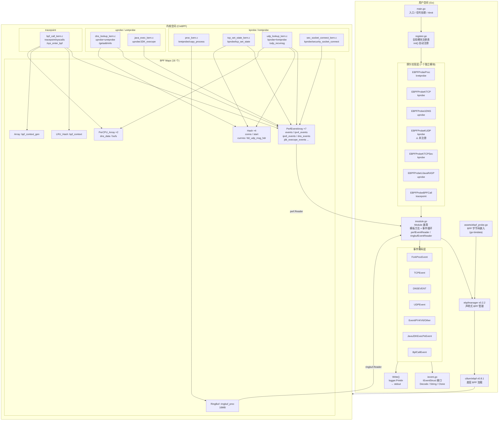
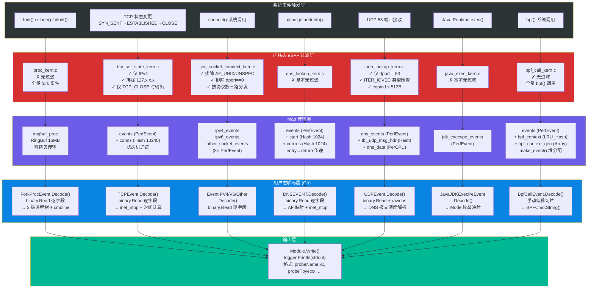

# ehids-agent 深度技术分析报告

> 分析日期：2026-03-27
> 项目来源：https://github.com/ehids/ehids-agent （美团安全工程团队）
> 技术栈：Go 1.17 + cilium/ebpf v0.8.1 + ebpfmanager v0.2.2
> 分析范围：全部内核态 eBPF 程序（7 个 C 文件）、用户态 Go 代码（20+ 文件）、构建系统

---

## 1. 执行摘要

### 1.1 项目定位

ehids-agent 是一个基于 eBPF 技术的轻量级主机入侵检测系统（HIDS）事件采集层。项目利用 kprobe/uprobe/tracepoint 三类 eBPF Hook 机制，以零侵入方式在内核态实时采集进程创建、TCP 连接、DNS 解析、Socket 外连、BPF 系统调用、Java 命令执行等 7 类安全事件，并通过 PerfEventArray/RingBuf 将事件高效传递到用户态 Go 程序进行解码输出。

### 1.2 核心能力

- **7 个独立监控模块**：进程 Fork、TCP 状态追踪、Socket 连接监控、用户态 DNS、内核态 UDP/DNS（未激活）、BPF 系统调用审计、Java RASP
- **9 个 eBPF Hook 点**：4 kprobe + 2 kretprobe + 2 uprobe/uretprobe + 1 tracepoint
- **16 个 BPF Map**：7 PerfEventArray + 1 RingBuf + 4 Hash + 1 LRU_Hash + 1 Array + 2 PerCPU_Array
- **CO-RE 跨版本兼容**：通过 vmlinux.h + BPF_CORE_READ 实现一次编译、多内核运行
- **单文件零依赖部署**：go-bindata 嵌入 BPF 字节码 + CGO_ENABLED=0 静态编译

### 1.3 主要发现

| 维度 | 评级 | 关键发现 |
|------|------|---------|
| 架构设计 | ⭐⭐⭐⭐ | 模块化可插拔设计优秀，IModule + IEventStruct 接口抽象合理，新增探针无需修改框架 |
| 内核态实现 | ⭐⭐⭐⭐ | Hook 点选择合理，内核态过滤高效，make_event() 堆分配模式巧妙规避栈限制 |
| 用户态实现 | ⭐⭐ | 事件处理管线完整但存在阻塞设计缺陷，PerfEvent buffer 严重不足（仅 4KB） |
| 工程质量 | ⭐⭐ | 零测试覆盖、无配置系统、依赖严重过时、Fatalf 可致进程崩溃 |
| 安全覆盖 | ⭐⭐ | 缺失 execve 监控是致命短板，无文件系统/权限变更/进程注入检测 |

### 1.4 综合评价

ehids-agent 是一个**架构设计优秀的 PoC/教学级项目**，清晰展示了 eBPF HIDS 的核心设计模式（模块注册、内核态过滤、Map 通信、用户态解码）。其模块化接口设计、CO-RE 支持、make_event() 堆分配技巧等具有较高的学习参考价值。但在性能调优（PerfBuffer 4KB）、错误处理（Fatalf 致崩）、检测覆盖（无 execve）、工程化（零测试、零配置）等方面距离生产就绪有较大差距。**综合评分：3.2/10**（PoC 级别可接受，生产级别不可用）。

---

## 2. 架构总览图



---

## 3. Hook 点全景表

| # | Hook 类型 | 挂钩目标 | 所在源文件 | eBPF 函数名 | 触发条件 | 采集数据 | ABI 稳定性 | 状态 |
|---|----------|---------|-----------|-------------|---------|---------|-----------|------|
| 1 | **kretprobe** | `copy_process` | `proc_kern.c` | `kretprobe_copy_process` | fork/clone/vfork | 3 级进程树 (child/parent/grandparent PID)、comm、cmdline、filepath、uid/gid、uts_inum、start_time | ⚠️ 中等 | ✅ 已注册 |
| 2 | **kprobe** | `tcp_set_state` | `tcp_set_state_kern.c` | `kprobe__tcp_set_state` | TCP 状态变更 | 四元组 (laddr:lport→raddr:rport)、方向 (IN/OUT)、持续时间、rx/tx 字节数、pid/uid/comm | ⚠️ 中等 | ✅ 已注册 |
| 3 | **uprobe** | `getaddrinfo` (libc) | `dns_lookup_kern.c` | `getaddrinfo_entry` | glibc DNS 查询入口 | hostname、pid、addrinfo** 结果指针 | ⚠️ 中等 | ✅ 已注册 |
| 4 | **uretprobe** | `getaddrinfo` (libc) | `dns_lookup_kern.c` | `getaddrinfo_return` | glibc DNS 查询返回 | 解析结果 IP (IPv4/IPv6)、hostname、pid/uid、af | ⚠️ 中等 | ✅ 已注册 |
| 5 | **kprobe** | `udp_recvmsg` | `udp_lookup_kern.c` | `trace_udp_recvmsg` | UDP 接收（过滤 dport=53） | sock*、msghdr* | ⚠️ 高风险 | ⚠️ **未注册** |
| 6 | **kretprobe** | `udp_recvmsg` | `udp_lookup_kern.c` | `trace_ret_udp_recvmsg` | udp_recvmsg 返回 | DNS 原始报文 (≤512B)、pid/comm | ⚠️ 高风险 | ⚠️ **未注册** |
| 7 | **kprobe** | `security_socket_connect` | `sec_socket_connect_kern.c` | `kprobe__security_socket_connect` | connect() 系统调用 | IPv4: 四元组+ts；IPv6: raddr+rport；Other: af+pid | ✅ 较稳定 | ✅ 已注册 |
| 8 | **uprobe** | `JDK_execvpe` (libjava.so) | `java_exec_kern.c` | `java_JDK_execvpe` | Java Runtime.exec() | pid、mode、file 路径 | ⚠️ 高风险 | ✅ 已注册 |
| 9 | **tracepoint** | `syscalls/sys_enter_bpf` | `bpf_call_kern.c` | `tracepoint_sys_enter_bpf` | bpf() 系统调用 | bpf cmd、3 级进程树、uid/euid/gid/egid、comm、cmdline、uts_name、start_time | ✅ 稳定 | ✅ 已注册 |

**统计**：共 9 个 BPF 程序入口，分布在 7 个 C 文件中。实际激活 7 个（KUDP 模块 Register 被注释）。

---

## 4. 数据流全景图



---

## 5. 核心功能实现详解

### 5.1 进程行为检测（EBPFProbeProc）

**Hook 点**：`kretprobe/copy_process` — 在内核 `copy_process()` 函数返回时触发，覆盖 fork/clone/vfork 全部进程创建路径。选择 kretprobe 而非 kprobe 的原因是需要通过 `PT_REGS_RC(regs)` 获取返回值——新创建子进程的 `task_struct` 指针。

**数据采集**：使用 `BPF_CORE_READ` 宏链式读取子进程 `task_struct`，采集三级进程族谱（child → parent → grandparent 的 pid/tgid）、命令行（通过 `bpf_probe_read_user` 读取 `mm->arg_start`）、可执行文件路径、UID/GID、UTS namespace inode（支持容器场景标识）、进程启动时间等共 13 个字段。

**传输机制**：这是项目中**唯一使用 RingBuf** 的模块（16MB），采用 `bpf_ringbuf_reserve` + `bpf_ringbuf_submit` 零拷贝语义，相比 PerfEventArray 具有全局有序、无需 per-CPU 缓冲区、内存效率更高等优势。当 RingBuf 满时 `reserve` 返回 NULL，内核端直接丢弃（用户态无感知）。

**关键局限**：此模块**仅 Hook fork 阶段，完全缺失 execve 监控**。fork 时采集的 cmdline/filepath 实际是父进程的信息，攻击者执行的实际命令在 exec 后才确定。这是项目最严重的检测盲区。cmdline 缓冲区仅 128 字节，超长命令被截断。

### 5.2 TCP 连接生命周期追踪（EBPFProbeKTCP）

**Hook 点**：`kprobe/tcp_set_state` — TCP 状态机转换的**唯一入口**，一个 Hook 点即可追踪完整连接生命周期。

**状态机设计**：使用 `struct sock*` 作为 `conns` Hash Map（10240 条目）的 key，实现有状态的连接追踪：SYN_SENT 时创建连接记录（标记出站）→ ESTABLISHED 时更新连接状态（入站连接在此创建记录）→ TCP_CLOSE 时从 `tcp_sock` 读取 `bytes_received/bytes_acked` 流量统计，计算连接持续时间，一次性输出完整连接元数据后删除 Map 条目。

**内核态过滤**：三层过滤——① 仅在 TCP_CLOSE 时生成事件（过滤 80%+ 中间状态调用）；② 仅处理 AF_INET（IPv4）；③ 排除 127.x.x.x 本地回环。过滤效率高但 **IPv6 完全不支持**是显著盲区。

**技术细节**：使用 `bpf_probe_read` 而非 `BPF_CORE_READ` 读取 `sock.__sk_common` 和 `tcp_sock` 字段，缺少 CO-RE 支持，跨内核版本兼容性较差。

### 5.3 DNS 双层监控（EBPFProbeUDNS + EBPFProbeKUDP）

**用户态 DNS（uprobe/getaddrinfo）**：通过 uprobe/uretprobe 配对 Hook glibc `getaddrinfo()`。入口函数捕获域名字符串（`PT_REGS_PARM1`）和结果指针（`(ctx)->cx`），通过 `start` 和 `currres` 两个 Hash Map（以 PID 为 key）传递上下文。返回函数从 Map 恢复上下文，经三级指针解引用获取 `addrinfo` 链表中的解析结果 IP 地址（支持 IPv4/IPv6）。

**内核态 DNS（kprobe/udp_recvmsg）**：在 kprobe 入口通过 `dport == 13568`（ntohs(53)）精确过滤 DNS 流量，仅 DNS 包写入 `tbl_udp_msg_hdr` Map。kretprobe 通过 `iov_iter` → `iovec` → `iov_base` 读取实际 DNS 报文数据，使用 `dns_data` PerCPU_Array 规避栈限制，动态长度 `bpf_perf_event_output` 节省带宽。

**互补关系**：uprobe 方案可直接获取人类可读域名但仅覆盖 glibc；kprobe 方案覆盖所有 UDP DNS 流量但需解析协议。两者互补覆盖。但 KUDP 模块 `Register` 被注释，实际未激活。uprobe 路径硬编码 `/lib/x86_64-linux-gnu/libc.so.6`，musl libc（Alpine 容器）和静态编译程序（Go/Rust）完全不覆盖。

### 5.4 Socket 连接安全监控（EBPFProbeKTCPSec）

**Hook 点**：`kprobe/security_socket_connect` — LSM 框架标准安全检查点，位于 `connect()` 系统调用路径中，协议无关。一个 Hook 覆盖 IPv4、IPv6 及其他协议族，优于 `tcp_v4_connect` + `tcp_v6_connect` 的组合。

**三路分发设计**：按 `sockaddr.sa_family` 分发到 3 个独立 PerfEventArray：IPv4（含四元组 + 时间戳）→ `ipv4_events`；IPv6（含 128 位地址 + 端口）→ `ipv6_events`；其他协议族 → `other_socket_events`。排除 AF_UNIX（进程间通信高频）和 AF_UNSPEC，dport=0 的无效连接也被过滤。用户态通过 3 个独立 perfEventReader 并行消费。

### 5.5 BPF 系统调用审计（EBPFProbeBPFCall）

**Hook 点**：`tracepoint/syscalls/sys_enter_bpf` — Syscall tracepoint 属于内核 UAPI，保证向后兼容。相比 kprobe/__sys_bpf 无需处理架构差异。

**核心技术——make_event() 堆分配模式**：这是项目中最复杂的 eBPF 程序（310 行）。`struct bpf_context_t` 含 `struct proc_common`（约 428+ 字节），超过 eBPF 512 字节栈限制。解决方案：① 从 `bpf_context_gen`（ARRAY，单例零值模板）获取模板；② 以 pid_tgid 为 key 写入 `bpf_context`（LRU_HASH，2048 条目）；③ 再次 lookup 获取 Map 中的可写指针（堆地址）。LRU_HASH 选型确保高频场景下旧条目自动淘汰。

**数据采集极为丰富**：`get_common_proc()` 通过约 20 次 `READ_KERN` 宏展开，采集当前/父/祖父进程三级族谱（含 namespace PID 映射，支持容器场景）、uid/euid/gid/egid、comm、cmdline（用户态内存）、UTS namespace 名称和 inode、进程启动时间。

**特殊用户态路径**：使用 ebpfmanager 内置的 PerfMap 回调机制（`DataHandler`），绕过基类 `readEvents()` 通用路径。`lostEventsHandle` 为空实现。

### 5.6 Java RASP（EBPFProbeUJavaRASP）

**Hook 点**：`uprobe/JDK_execvpe` — JDK Runtime.exec() 的最终 native 执行路径。通过硬编码偏移 `UprobeOffset: 0x19C30` 定位函数，仅适用于 OpenJDK 8u292 特定版本。

**实现极简**（55 行内核代码）：读取 mode（执行模式：FORK/POSIX_SPAWN/VFORK/CLONE）、file 路径（`bpf_probe_read_user_str`，128 字节）、pid，直接 `bpf_perf_event_output` 输出。无状态 Map、无循环、无复杂逻辑。

**核心问题**：硬编码 JDK 路径 `/usr/lib/jvm/java-8-openjdk-amd64/jre/lib/amd64/libjava.so` 和函数偏移量，JDK 版本/发行版变更即完全失效。`JDK_execvpe` 是 JDK 内部非公开函数，ABI 稳定性极差。

### 5.7 模块框架与事件处理管线

**模板方法模式**：`Module` 基类通过 `child IModule` 指针实现多态调度。`Run()` 定义流程骨架（`child.Start()` → `readEvents()` → `go run()`），子类只需实现差异化部分（`Start/Events/DecodeFun/Close`）。每个 probe 文件在 `init()` 中自动注册到全局 modules map，main.go 无需硬编码模块列表。

**事件处理管线**：内核 Map → Reader goroutine（perf.Reader/ringbuf.Reader）→ Clone() 创建新事件对象（原型模式）→ Decode() 二进制反序列化 → String() 格式化富化 → Write() 日志输出。每个 Map 一个独立 reader goroutine，全部通过 context 统一取消。

**关键设计缺陷**：`readEvents()` 内部无限循环等待 errChan，**永远不会正常返回**，导致 `go run()` 在正常情况下永远不执行，context 取消信号无法被感知（对非 BPFCall 模块）。PerfEvent reader 缓冲区仅 `os.Getpagesize()`（4KB），高负载下事件丢失率可达 99%+。

---

## 6. 安全性评估

### 6.1 MITRE ATT&CK 覆盖矩阵

| ATT&CK 战术 | 覆盖的技术 | 未覆盖的关键技术 | 覆盖程度 |
|-------------|-----------|----------------|---------|
| **Execution** | T1059 命令解释器（部分，仅 fork）、T1203 客户端利用（Java） | T1059 完整命令执行（无 execve）、T1053 计划任务 | ⚠️ 20% |
| **Discovery** | T1071.004 DNS、T1046 网络服务发现 | T1082 系统信息发现 | ⚠️ 30% |
| **C2** | T1071.001 Web 协议（IP/Port 级）、T1071.004 DNS C2 | T1572 协议隧道、T1095 非应用层协议（完整） | ⚠️ 20% |
| **Defense Evasion** | T1014 eBPF Rootkit（可检测 bpf() 调用） | T1055 进程注入、T1140 去混淆、T1070 痕迹清除 | ⚠️ 10% |
| **Persistence** | — | T1543 系统服务、T1053 计划任务、T1546 事件触发 | ❌ 0% |
| **Privilege Escalation** | — | setuid/capset/内核模块加载 | ❌ 0% |
| **Lateral Movement** | T1021 远程服务（TCP 级别） | — | ⚠️ 10% |

### 6.2 逃逸风险分析

**低难度绕过方式（影响严重）**：

| 绕过方式 | 目标模块 | 难度 | 说明 |
|---------|---------|------|------|
| 直接 execve 不 fork | 进程监控 | 🟢 低 | 不触发 copy_process |
| 使用 IPv6 | TCP 追踪 | 🟢 低 | tcp_set_state_kern.c 直接丢弃 IPv6 |
| 静态编译程序 | DNS uprobe | 🟢 低 | 不使用 glibc getaddrinfo |
| 使用 musl libc | DNS uprobe | 🟢 低 | 路径硬编码不匹配 |
| DoH/DoT | DNS 全部 | 🟢 低 | 完全绕过 |
| 非 JDK8 版本 | Java RASP | 🟢 低 | 偏移量不匹配 |
| AF_UNIX 中继 | Socket 监控 | 🟢 低 | 明确排除 AF_UNIX |
| 本地回环通信 | TCP 追踪 | 🟢 低 | 明确排除 127.x.x.x |
| prctl(PR_SET_NAME) | 进程监控 | 🟢 低 | 运行时修改 comm |

**Root 权限下的攻击面**：ehids-agent **完全缺失自我保护机制**。Root 攻击者可：`kill -9` 杀死进程（无 watchdog）、`echo 0 > /sys/kernel/debug/kprobes/enabled` 全局禁用 kprobe、`bpftool prog detach` 卸载 eBPF 程序、直接修改 BPF Map 数据注入虚假事件或删除真实记录。

### 6.3 TOCTOU 风险

1. **进程监控**：fork 时读取的 cmdline/filepath 是父进程数据，exec 后才是真实命令
2. **DNS uprobe**：entry 读取 hostname 与 return 读取结果之间存在窗口期
3. **BPF 调用**：sys_enter 时 `uattr` 指向的用户态内存可被其他线程修改

### 6.4 自身安全性

| 保护能力 | 状态 |
|---------|------|
| 进程自保护 / Watchdog | ❌ 缺失 |
| eBPF 程序完整性校验 | ❌ 缺失 |
| BPF Map 权限控制（BPF_F_RDONLY） | ❌ 缺失 |
| 二进制 / ELF 签名验证 | ❌ 缺失 |
| 心跳 / 存活检测 | ❌ 缺失 |
| 防篡改审计日志 | ❌ 缺失 |
| Perf Buffer 溢出告警 | ⚠️ 仅打印日志 |
| RingBuf 丢失感知 | ❌ 用户态无感知 |

---

## 7. 性能评估

### 7.1 CPU 开销

| 模块 | 触发频率 | 单次开销 | 总 CPU 影响 |
|------|---------|---------|------------|
| security_socket_connect | 每次 connect() | ~200-500ns | ⭐⭐⭐ 中等（高并发服务器可达 1-3%） |
| tcp_set_state | 每次 TCP 状态变化 | ~300-800ns | ⭐⭐⭐ 中等 |
| udp_recvmsg | 每次 UDP 接收 | ~100ns（非 53 端口快速返回） | ⭐ 极低 |
| copy_process | 每次 fork/clone | ~500-1000ns | ⭐⭐ 低 |
| sys_enter_bpf | 每次 bpf() 调用 | ~1-3μs | ⭐ 极低（BPF 调用稀少） |
| getaddrinfo uprobe | 每次 DNS 解析 | ~1-5μs（含 uretprobe） | ⭐⭐ 低 |
| JDK_execvpe uprobe | Java exec 时 | ~1-5μs | ⭐ 极低 |

**特别关注**：`bpf_call_kern.c` 的 `print_debug()` 在 `#if 1` 条件下**始终编译启用**，包含 10 次 `bpf_trace_printk` 调用，生产环境下会严重影响性能。

### 7.2 内存开销

| 资源 | 大小 | 占比 |
|------|------|------|
| ringbuf_proc (RingBuf) | 16 MB | 88% |
| bpf_context (LRU_Hash) | ~1 MB | 5.5% |
| conns (Hash) | ~380 KB | 2% |
| bufs (PerCPU_Array, 8 核) | ~96 KB | 0.5% |
| PerfEvent buffers (7 × 4KB × nCPU) | ~224 KB (8 核) | 1.2% |
| 其他 Hash/Array Maps | ~500 KB | 2.8% |
| **总计 (8 核系统)** | **约 18-20 MB** | 100% |

### 7.3 高负载表现——PerfEvent Buffer 是致命瓶颈

```go
// imodule.go:139 — 所有 PerfEvent 模块共用此配置
rd, err := perf.NewReader(em, os.Getpagesize())  // 仅 4KB！
```

**这是项目中最严重的性能问题。** 以 `ipv4_event_t`（~46B + 16B perf header ≈ 62B/event）为例：

- 4KB buffer 仅容纳约 **65 个事件**
- 1000 events/s 场景：约 93% 丢失
- 10000 events/s 场景：约 **99.3% 丢失**

与之对比，`ringbuf_proc` 的 16MB 配置可缓冲约 48,000 条 fork 事件，设计合理。PerfEvent 的 4KB 很可能是疏忽而非有意为之。

**用户态瓶颈**：`Write()` 方法同步调用 `logger.Println`，高负载下日志 I/O 成为反压源，进一步加剧 buffer 溢出。无批量处理、异步写入或采样机制。

---

## 8. 与同类项目对比矩阵

| 能力维度 | **ehids-agent** | **Falco** | **Tetragon** | **Tracee** |
|---------|----------------|-----------|-------------|-----------|
| **定位** | PoC / 教学 | 生产级云原生运行时安全 | 生产级安全可观测性 | 生产级安全追踪 |
| **进程创建** | ⚠️ 仅 fork | ✅ execve/fork/clone | ✅ 全生命周期 | ✅ 全生命周期 |
| **execve 监控** | ❌ **缺失** | ✅ | ✅ | ✅ |
| **文件系统监控** | ❌ 缺失 | ✅ | ✅ | ✅ |
| **TCP 网络** | ⚠️ IPv4 only | ✅ TCP+UDP | ✅ TCP+UDP | ✅ TCP+UDP |
| **DNS 监控** | ⚠️ glibc only | ✅ 内核级 | ✅ 内核级 | ✅ 内核级 |
| **容器感知** | ⚠️ 仅 UTS ns | ✅ K8s 深度集成 | ✅ K8s 深度集成 | ✅ K8s 深度集成 |
| **策略引擎** | ❌ 无 | ✅ YAML 规则 | ✅ TracingPolicy CRD | ✅ Rego/Signatures |
| **BPF syscall 审计** | ✅ **独特优势** | ⚠️ 有限 | ✅ | ✅ |
| **Java RASP** | ⚠️ JDK8 only，**独特** | ❌ | ❌ | ❌ |
| **内核模块监控** | ❌ | ✅ | ✅ | ✅ |
| **权限变更监控** | ❌ | ✅ | ✅ | ✅ |
| **进程注入** | ❌ | ✅ | ✅ | ✅ |
| **BPF LSM 支持** | ❌ | ❌ | ✅ | ✅ |
| **实时告警** | ❌ 仅 stdout | ✅ 多渠道 | ✅ 多渠道 | ✅ 多渠道 |
| **事件丢失保护** | ❌ | ⚠️ 有限 | ✅ | ✅ |
| **自我保护** | ❌ | ⚠️ 有限 | ✅ | ⚠️ 有限 |
| **CO-RE** | ✅ | ⚠️ 内核模块模式 | ✅ | ✅ |
| **部署复杂度** | ⭐ 单二进制 | ⭐⭐⭐ Helm/DaemonSet | ⭐⭐ DaemonSet | ⭐⭐ DaemonSet |
| **代码量** | ~2000 行 | ~100K+ | ~200K+ | ~150K+ |
| **生产就绪度** | ❌ PoC | ✅ 成熟 | ✅ 成熟 | ✅ 成熟 |

**ehids-agent 独特优势**：
1. BPF 系统调用专项审计（可检测 eBPF rootkit 加载行为）
2. Java RASP uprobe 思路（直接 Hook JDK native 函数）
3. 极致轻量（单二进制，~2000 行代码，启动即运行）
4. 三代进程树追踪（child → parent → grandparent）
5. 学习/教学价值极高（模块化清晰、接口设计优雅）

---

## 9. 优缺点总结

### 9.1 架构设计

| ✅ 优点 | ❌ 缺点 |
|---------|---------|
| IModule + IEventStruct 接口抽象合理，可插拔设计 | 缺乏配置系统，模块启停通过注释代码控制 |
| init() 自动注册模式，新增探针无需修改框架 | 缺乏策略引擎/规则引擎 |
| 模板方法模式实现事件处理流程骨架 | 输出仅 logger.Println，无可配置后端 |
| CO-RE + NOCORE 双编译模式，最大化兼容性 | 无 Graceful Shutdown（仅 sleep 100ms） |
| go-bindata 单文件零依赖部署 | readEvents() 阻塞设计导致 run() 永不执行 |

### 9.2 内核态实现

| ✅ 优点 | ❌ 缺点 |
|---------|---------|
| Hook 点选择合理（security_socket_connect、tcp_set_state 等） | TCP 模块不支持 IPv6 |
| make_event() 堆分配模式巧妙规避 512B 栈限制 | tcp_set_state 未使用 CO-RE（bpf_probe_read） |
| 内核态过滤高效（UDP port 53、TCP state、AF 分发） | proc_kern.c 无 execve 监控 |
| RingBuf 零拷贝（进程模块） | KUDP 模块 Register 被注释未激活 |
| BPF Call 模块数据采集极为丰富（19 字段） | print_debug() 始终编译启用 |
| 三级进程树 + Namespace PID 映射 | common.h 定义了未使用的 event/tr_file/tr_text 结构体 |

### 9.3 用户态实现

| ✅ 优点 | ❌ 缺点 |
|---------|---------|
| Clone() 原型模式避免并发解码冲突 | PerfEvent buffer 仅 4KB，严重不足 |
| LostSamples 检测（PerfEvent） | Fatalf 可致整个进程崩溃（probe_bpf_call.go:133） |
| ebpfmanager 声明式配置简化 Hook 管理 | Close() 方法定义但从未被调用，资源泄漏 |
| 并发安全（logger 线程安全、eventFuncMaps 只读） | Decode 函数无 payload 长度校验（panic 风险） |
| DNS 深度解析使用 rawdns 库 | 同步日志输出成为高负载瓶颈 |

### 9.4 工程质量

| ✅ 优点 | ❌ 缺点 |
|---------|---------|
| 清晰的目录结构（kern/user/assets） | 零测试覆盖（无 *_test.go） |
| Makefile 支持 CO-RE/NOCORE 双模式构建 | 依赖严重过时（cilium/ebpf v0.8.1，Go 1.17） |
| 接口定义清晰 | probe 模块间大量重复代码（DRY 违反） |
| | 常量跨文件重复定义（TASK_COMM_LEN 5 次） |
| | 无结构化日志、无指标暴露、无配置管理 |
| | Go 接收者全用 `this`，不符合惯例 |
| | 头文件守护宏 `ECAPTURE_COMMON_H`（从 eCapture 复制遗留） |
| | go-bindata 已弃用，应迁移到 Go embed |

---

## 10. 改进建议

### P0 — 紧急修复（功能/可用性致命问题）

| # | 问题 | 影响 | 修复建议 |
|---|------|------|---------|
| 1 | **PerfEvent buffer 仅 4KB** | 高负载下丢失 99%+ 事件，核心功能失效 | 将 `os.Getpagesize()` 改为 `256 * os.Getpagesize()`（1MB），或作为可配置参数 |
| 2 | **`probe_bpf_call.go:133` Fatalf 致崩** | decode 失败导致整个 agent 进程退出，攻击者可利用 | 将 `Fatalf` 改为 `Printf` + continue |
| 3 | **退出时未调用 Close()** | eBPF 程序和 Map 可能残留内核 | 在 main.go cancelFun() 后遍历 modules 调用 Close()，并用 WaitGroup 等待完成 |
| 4 | **print_debug() 始终编译启用** | bpf_call_kern.c 10 次 bpf_trace_printk 严重影响生产性能 | 将 `#if 1` 改为 `#ifdef DEBUG_PRINT` |

### P1 — 重要改进（安全/兼容性/运维关键）

| # | 问题 | 影响 | 修复建议 |
|---|------|------|---------|
| 5 | **缺失 execve 监控** | 无法捕获实际执行的命令，安全检测严重残缺 | 新增 `tracepoint/syscalls/sys_enter_execve` 或 `kprobe/do_execveat_common` |
| 6 | **依赖严重过时** | cilium/ebpf v0.8.1、Go 1.17，存在安全风险和兼容性问题 | 升级 cilium/ebpf 到最新稳定版，Go 升级到 1.21+，go-bindata 替换为 `//go:embed` |
| 7 | **uprobe 路径硬编码** | 非 Debian 系统无法运行 DNS/Java 模块 | 运行时动态查找 libc/JDK 路径（如 `/proc/self/maps` 或 `ldconfig -p`） |
| 8 | **TCP 模块不支持 IPv6** | 现代网络环境 IPv6 流量不可忽视 | 扩展 event_t 结构体支持 IPv6 地址，移除 `AF_INET` 硬过滤 |
| 9 | **无配置系统** | 所有参数硬编码，运维困难 | 引入 YAML 配置文件（模块启停、buffer 大小、uprobe 路径、输出后端） |
| 10 | **readEvents() 阻塞导致 run() 永不执行** | context 取消信号无法被感知 | 将 readEvents() 中的 errChan 监听改为 goroutine，或使用 reader.SetDeadline |
| 11 | **Decode 无长度校验** | 截断 payload 导致 panic → goroutine 崩溃 | 在 Decode 开头添加 `if len(data) < expectedLen { return ErrShortPayload }` |

### P2 — 建议改进（工程化/可维护性提升）

| # | 问题 | 影响 | 修复建议 |
|---|------|------|---------|
| 12 | **零测试覆盖** | 无法保证代码质量和回归 | 为 Decode/String 纯函数添加单元测试和 fuzz 测试 |
| 13 | **probe 模块大量重复代码** | 新增模块需复制粘贴 100+ 行 | 抽取 GenericProbe 工厂模式，通过配置注入差异化部分 |
| 14 | **无结构化输出** | 仅文本日志，无法对接 SIEM | 引入 IWriter 接口，支持 JSON/Kafka/gRPC 等可插拔输出后端 |
| 15 | **无指标暴露** | 运维无法感知 agent 健康状态 | 添加 Prometheus /metrics 端点（事件处理量/丢失量/延迟） |
| 16 | **常量重复定义** | 维护成本高，易不一致 | 统一在 common.h 定义 TASK_COMM_LEN/AF_INET 等 |
| 17 | **内核版本兼容性** | udp_recvmsg 签名 5.19+ 变化、iter.type 6.0+ 重命名 | 添加内核版本检测和条件编译分支 |
| 18 | **无策略引擎** | 所有事件仅输出日志，无规则匹配 | 在 Write() 前插入规则匹配层，支持 YAML/Rego 规则 |
| 19 | **无自我保护** | Root 攻击者可轻易杀死/篡改 agent | 添加 watchdog 进程守护、eBPF 程序完整性校验、Map 权限控制 |
| 20 | **BPF Call 模块无内核态过滤** | Cilium/Calico 等环境大量 BPF 操作产生噪音 | 添加基于 cmd 白名单的过滤（仅关注 BPF_PROG_LOAD/BPF_MAP_CREATE） |

---

*本报告基于 ehids-agent 源码全量审计，综合前 7 个阶段深度分析文档生成。*
*分析工具：Claude Code / 日期：2026-03-27*
